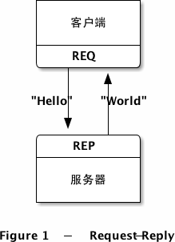
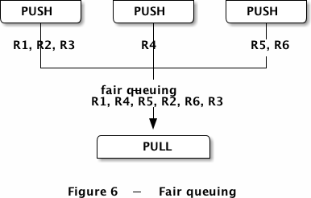
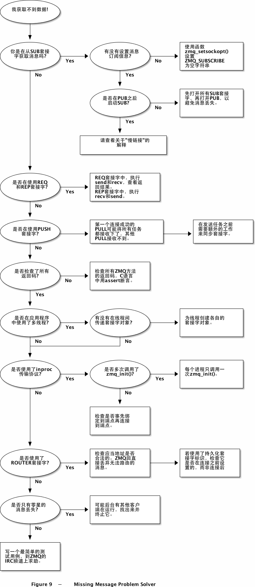
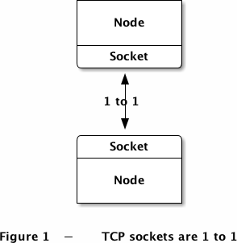
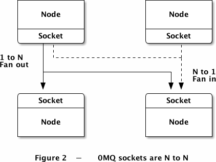

# 1. 官方文档翻译

['开源地址'](https://gitee.com/solym/ZeroMQ-Guide-Zh/blob/master/chapter1.md)  
库的安装
```
vcpkg install zeromq:x64-windows-static
vcpkg install zeromq:x86-windows-static
```
# 2. ZeroMQ基础
## 2.1. 前言
如何解释ZMQ？有些人会先说一堆ZMQ的好：它是一套用于快速构建的套接字组件；它的信箱系统有超强的路由能力；它太快了！而有些人则喜欢分享他们被ZMQ点悟的时刻，那些被灵感击中的瞬间：所有的事情突然变得简单明了，让人大开眼界。另一些人则会拿ZMQ同其他产品做个比较：它更小，更简单，但却让人觉得如此熟悉。对于我个人而言，我则更倾向于和别人分享ZMQ的诞生史，相信会和各位读者有所共鸣。  
编程是一门科学，但往往会乔装成一门艺术。我们从不去了解软件最底层的机理，或者说根本没有人在乎这些。软件并不只是算法、数据结构、编程语言、或者抽象云云，这些不过是一些工具而已，被我们创造、使用、最后抛弃。软件真正的本质，其实是人的本质。  
举例来说，当我们遇到一个高度复杂的问题时，我们会群策群力，分工合作，将问题拆分为若干个部分，一起解决。这里就体现了编程的科学：创建一组小型的构建模块，让人们易于理解和使用，那么大家就会一起用它来解决问题。  
我们生活在一个普遍联系的世界里，需要现代的编程软件为我们做指引。所以，未来我们所需要的用于处理大规模计算的构建模块，必须是普遍联系的，而且能够并行运作。那时，程序代码不能再只关注自己，它们需要互相交流，变得足够健谈。程序代码需要像人脑一样，数以兆计的神经元高速地传输信号，在一个没有中央控制的环境下，没有单点故障的环境下，解决问题。这一点其实并不意外，因为就当今的网络来讲，每个节点其实就像是连接了一个人脑一样。  
如果你曾和线程、协议、或网络打过交道，你会觉得我上面的话像是天方夜谭。因为在实际应用过程中，只是连接几个程序或网络就已经非常困难和麻烦了。数以兆计的节点？那真是无法想象的。现今只有资金雄厚的企业才能负担得起这种软件和服务  
当今世界的网络结构已经远远超越了我们自身的驾驭能力。十九世纪八十年代的软件危机，弗莱德•布鲁克斯曾说过，这个世上没有银弹。后来，免费和开源解决了这次软件危机，让我们能够高效地分享知识。如今，我们又面临一次新的软件危机，只不过我们谈论得不多。只有那些大型的、富足的企业才有财力建立高度联系的应用程序。那里有云的存在，但它是私有的。我们的数据和知识正在从我们的个人电脑中消失，流入云端，无法获得或与其竞争。是谁坐拥我们的社交网络？这真像一次巨型主机的革命。  
我们暂且不谈其中的政治因素，光那些就可以另外出本书了。目前的现状是，虽然互联网能够让千万个程序相连，但我们之中的大多数却无法做到这些。这样一来，那些真正有趣的大型问题（如健康、教育、经济、交通等领域），仍然无法解决。我们没有能力将代码连接起来，也就不能像大脑中的神经元一样处理那些大规模的问题。  
已经有人尝试用各种方法来连接应用程序，如数以千计的IETF规范，每种规范解决一个特定问题。对于开发人员来说，HTTP协议是比较简单和易用的，但这也往往让问题变得更糟，因为它鼓励人们形成一种重服务端、轻客户端的思想。  
所以迄今为止人们还在使用原始的TCP/UDP协议、私有协议、HTTP协议、网络套接字等形式连接应用程序。这种做法依旧让人痛苦，速度慢又不易扩展，需要集中化管理。而分布式的P2P协议又仅仅适用于娱乐，而非真正的应用。有谁会使用Skype或者Bittorrent来交换数据呢？  
这就让我们回归到编程科学的问题上来。想要拯救这个世界，我们需要做两件事情：一，如何在任何地点连接任何两个应用程序；二、将这个解决方案用最为简单的方式包装起来，供程序员使用。  
也许这听起来太简单了，但事实确实如此。  
## 2.2. ZMQ简介
ZMQ（ØMQ、ZeroMQ, 0MQ）看起来像是一套嵌入式的网络链接库，但工作起来更像是一个并发式的框架。它提供的套接字可以在多种协议中传输消息，如线程间、进程间、TCP、广播等。你可以使用套接字构建多对多的连接模式，如扇出、发布-订阅、任务分发、请求-应答等。ZMQ的快速足以胜任集群应用产品。它的异步I/O机制让你能够构建多核应用程序，完成异步消息处理任务。ZMQ有着多语言支持，并能在几乎所有的操作系统上运行。ZMQ是iMatix公司的产品，以LGPL开源协议发布。  
### 2.2.1. 需要具备的知识
* 使用最新的ZMQ稳定版本；
* 使用Linux系统或其他相似的操作系统；  
* 能够阅读C语言代码，这是本指南示例程序的默认语言；
* 当我们书写诸如PUSH或SUBSCRIBE等常量时，你能够找到相应语言的实现，如ZMQ_PUSH、ZMQ_SUBSCRIBE。  
### 2.2.2. 获取示例  
本指南的所有示例都存放于github仓库中，最简单的获取方式是运行以下代码：
```
git clone git://github.com/imatix/zguide.git
```
浏览examples目录，你可以看到多种语言的实现。如果其中缺少了某种你正在使用的语言，我们很希望你可以提交一份补充。这也是本指南实用的原因，要感谢所有做出过贡献的人。  
所有的示例代码都以MIT/X11协议发布，若在源代码中有其他限定的除外。  
### 2.2.3. 请求-应答
让我们从简单的代码开始，一段传统的Hello World程序。我们会创建一个客户端和一个服务端，客户端发送Hello给服务端，服务端返回World。下文是C语言编写的服务端，它在5555端口打开一个ZMQ套接字，等待请求，收到后应答World。   
  
客户端
```
TEST_CASE("client") {
	SECTION("#2") {
		zmq::context_t contex(1);
		zmq::socket_t request(contex, ZMQ_REQ);
		request.connect("tcp://localhost:5555");
		zmq::message_t req;
		memcpy((void *)req.data(), "Hello", 5);
		request.send(req);
		zmq::message_t revMsg;
		request.recv(&revMsg);
		std::cout << revMsg.data() << std::endl;
		request.close();
	}
}
```
服务端
```
TEST_CASE("server") {
	SECTION("#1") {
		// 准备上下文和套接字
		zmq::context_t context(1);
		zmq::socket_t socket(context, ZMQ_REP);
		socket.bind("tcp://*:5555");

		while (true) {
			zmq::message_t request;

			// 等待客户端请求
			socket.recv(&request);
			std::cout << "收到 Hello" << std::endl;

			// 做一些“处理”
			std::this_thread::sleep_for(std::chrono::seconds(3));

			// 应答World
			zmq::message_t reply(5);
			memcpy((void *)reply.data(), "World", 5);
			socket.send(reply);
		}
	}
}
```
理论上你可以连接千万个客户端到这个服务端上，同时连接都没问题，程序仍会运作得很好。你可以尝试一下先打开客户端，再打开服务端，可以看到程序仍然会正常工作，想想这意味着什么。  
让我简单介绍一下这两段程序到底做了什么。首先，他们创建了一个ZMQ上下文，然后是一个套接字。不要被这些陌生的名词吓到，后面我们都会讲到。服务端将REP套接字绑定到5555端口上，并开始等待请求，发出应答，如此循环。客户端则是发送请求并等待服务端的应答。  
这些代码背后其实发生了很多很多事情，但是程序员完全不必理会这些，只要知道这些代码短小精悍，极少出错，耐高压。这种通信模式我们称之为请求-应答模式，是ZMQ最直接的一种应用。你可以拿它和RPC及经典的C/S模型做类比。  
## 2.3. 关于字符串
ZMQ不会关心发送消息的内容，只要知道它所包含的字节数。所以，程序员需要做一些工作，保证对方节点能够正确读取这些消息。如何将一个对象或复杂数据类型转换成ZMQ可以发送的消息，这有类似Protocol Buffers的序列化软件可以做到。但对于字符串，你也是需要有所注意的。  
在C语言中，字符串都以一个空字符结尾，你可以像这样发送一个完整的字符串：  
```
zmq_msg_init_data (&request, "Hello", 6, NULL, NULL);
```
但是，如果你用其他语言发送这个字符串，很可能不会包含这个空字节，如你使用Python发送：  
```
socket.send ("Hello")
```
实际发送的消息是：  

如果你从C语言中读取该消息，你会读到一个类似于字符串的内容，甚至它可能就是一个字符串（第六位在内存中正好是一个空字符），但是这并不合适。这样一来，客户端和服务端对字符串的定义就不统一了，你会得到一些奇怪的结果  
当你用C语言从ZMQ中获取字符串，你不能够相信该字符串有一个正确的结尾。因此，当你在接受字符串时，应该建立多一个字节的缓冲区，将字符串放进去，并添加结尾。  
所以，让我们做如下假设：ZMQ的字符串是有长度的，且传送时不加结束符。在最简单的情况下，ZMQ字符串和ZMQ消息中的一帧是等价的，就如上图所展现的，由一个长度属性和一串字节表示。  
这段代码我们会在日后的示例中使用，我们可以顺手写一个s_send()方法，并打包成一个.h文件供我们使用。  
这就诞生了zhelpers.h，一个供C语言使用的ZMQ功能函数库。它的源代码比较长，而且只对C语言程序员有用，你可以在闲暇时看一看。  
## 2.4. 获取版本号
```
	SECTION("#version test") {
		auto vers = zmq::version();
		std::cout << std::get<0>(vers) << "-" << std::get<1>(vers) << "-" << std::get<2>(vers) << std::endl;
	}
```
## 2.5. 让msg流动起来-订阅者模式
第二种经典的消息模式是单向数据分发：服务端将更新事件发送给一组客户端。让我们看一个天气信息发布的例子，包括邮编、温度、相对湿度。我们生成这些随机信息，用来模拟气象站所做的那样。  
服务端
```
//准备上下文和pub套接字
		zmq::context_t context(1);
		zmq::socket_t publisher(context, ZMQ_PUB);
		publisher.bind("tcp://*:5556");
		//publisher.bind("ipc://weather.ipc");
		//初始化随机数生成器
		std::srand(std::time(nullptr));
		while (true) {
			int zipcode, temperature, relhumidity;
			zipcode = std::rand() % 10000;
			temperature = std::rand() % 215 - 80;
			relhumidity = std::rand() % 50 + 10;
			//向所有订阅者发送消息
			std::string s(zipcode + " " + temperature);
			s += " " + relhumidity;
			zmq::message_t msg(s.begin(), s.end());
			publisher.send(msg);
			std::cout << "send" << std::endl;
		}
```
客户端
```
TEST_CASE("public model") {
	//创建服务以及套接字
	zmq::context_t context(1);
	zmq::socket_t client(context, ZMQ_SUB);
	client.connect("tcp://localhost:5556");
	//设置订阅信息,默认为纽约,邮编10001 ;
	const char *filter = "10001 ";
	client.setsockopt(ZMQ_SUBSCRIBE, filter, strlen(filter));
	//处理100条更新信息
	int update_nbr;
	long total_temp = 0;
	for (update_nbr = 0; update_nbr < 100; update_nbr++) {

		zmq::message_t update;
		int zipcode, temperature, relhumidity;

		client.recv(&update);

		std::istringstream iss(static_cast<char*>(update.data()));
		iss >> zipcode >> temperature >> relhumidity;

		total_temp += temperature;
	}
	std::cout << "Average temperature for zipcode '" << filter
		<< "' was " << (int)(total_temp / update_nbr) << "F"
		<< std::endl;
}
```
  
这项更新服务没有开始、没有结束，就像永不消失的电波一样。  
需要注意的是，在使用SUB套接字时，必须使用zmq_setsockopt()方法来设置订阅的内容。如果你不设置订阅内容，那将什么消息都收不到，新手很容易犯这个错误。订阅信息可以是任何字符串，可以设置多次。只要消息满足其中一条订阅信息，SUB套接字就会收到。订阅者可以选择不接收某类消息，也是通过zmq_setsockopt()方法实现的。  
PUB-SUB套接字组合是异步的。客户端在一个循环体中使用zmq_recv()接收消息，如果向SUB套接字发送消息则会报错；类似地，服务端可以不断地使用zmq_send()发送消息，但不能在PUB套接字上使用zmq_recv()。  
关于PUB-SUB套接字，还有一点需要注意：你无法得知SUB是何时开始接收消息的。就算你先打开了SUB套接字，后打开PUB发送消息，这时SUB还是会丢失一些消息的，因为建立连接是需要一些时间的。很少，但并不是零。  
这种“慢连接”的症状一开始会让很多人困惑，所以这里我要详细解释一下。还记得ZMQ是在后台进行异步的I/O传输的，如果你有两个节点用以下顺序相连：  
* 订阅者连接至端点接收消息并计数；
* 发布者绑定至端点并立刻发送1000条消息。

运行的结果很可能是订阅者一条消息都收不到。这时你可能会傻眼，忙于检查有没有设置订阅信息，并重新尝试，但结果还是一样。  
我们知道在建立TCP连接时需要进行三次握手，会耗费几毫秒的时间，而当节点数增加时这个数字也会上升。在这么短的时间里，ZMQ就可以发送很多很多消息了。举例来说，如果建立连接需要耗时5毫秒，而ZMQ只需要1毫秒就可以发送完这1000条消息。   
第3章中我会解释如何使发布者和订阅者同步，只有当订阅者准备好时发布者才会开始发送消息。有一种简单的方法来同步PUB和SUB，就是让PUB延迟一段时间再发送消息。现实编程中我不建议使用这种方式，因为它太脆弱了，而且不好控制。不过这里我们先暂且使用sleep的方式来解决，等到第3章的时候再讲述正确的处理方式。  
另一种同步的方式则是认为发布者的消息流是无穷无尽的，因此丢失了前面一部分信息也没有关系。我们的气象信息客户端就是这么做的。  
示例中的气象信息客户端会收集指定邮编的一千条信息，其间大约有1000万条信息被发布。你可以先打开客户端，再打开服务端，工作一段时间后重启服务端，这时客户端仍会正常工作。当客户端收集完所需信息后，会计算并输出平均温度。  
关于发布-订阅模式的几点说明：  
* 订阅者可以连接多个发布者，轮流接收消息；
* 如果发布者没有订阅者与之相连，那它发送的消息将直接被丢弃；  
* 如果你使用TCP协议，那当订阅者处理速度过慢时，消息会在发布者处堆积。以后我们会讨论如何使用阈值（HWM）来保护发布者。  
* 在目前版本的ZMQ中，消息的过滤是在订阅者处进行的。也就是说，发布者会向订阅者发送所有的消息，订阅者会将未订阅的消息丢弃  
## 2.6. 分布式处理
下面一个示例程序中，我们将使用ZMQ进行超级计算，也就是并行处理模型：  
* 任务分发器会生成大量可以并行计算的任务；
* 有一组worker会处理这些任务；  
* 结果收集器会在末端接收所有worker的处理结果，进行汇总。  
  
现实中，worker可能散落在不同的计算机中，利用GPU（图像处理单元）进行复杂计算。下面是任务分发器的代码，它会生成100个任务，任务内容是让收到的worker延迟若干毫秒。 
模块主要由3块组成,分别为work,workDispach,Sink 
任务分发器
```
#pragma once
#include "Runable.h"
#include <zmq.hpp>
#include <stdlib.h>
#include <stdio.h>
#include <iostream>
#include <thread>
class TaskDispatch :
	public Runable
{
public:
	TaskDispatch(){}
	virtual ~TaskDispatch(){}
	virtual void RunTest() {
		zmq::context_t context(1);
		zmq::socket_t sender(context, ZMQ_PUSH);
		sender.bind("tcp://*:5557");
		std::cout << "Press Enter when the workers are ready: " << std::endl;
		getchar();
		std::cout << "Sending tasks to workers…\n" << std::endl;
		//第一个消息是0表示开始批处理信号
		zmq::socket_t sink(context, ZMQ_PUSH);
		sink.connect("tcp://localhost:5558");
		zmq::message_t message(2);
		memcpy(message.data(), "0", 1);
		sink.send(message);
		std::srand(time(nullptr));
		//发布100个任务
		int task_nbr;
		int total_msec = 0;     //  预计执行时间（毫秒）
		for (task_nbr = 0; task_nbr < 100; task_nbr++) {
			int workload;
			//  随机产生1-100毫秒的工作量
			workload = std::rand() % 100 + 1;
			total_msec += workload;

			message.rebuild(10);
			memset(message.data(), '\0', 10);
			sprintf_s((char *)message.data(), 10, "%d", workload);
			sender.send(message);
		}
		std::cout << "Total expected cost: " << total_msec << " msec" << std::endl;
		std::this_thread::sleep_for(std::chrono::milliseconds(1));
	}
};

```
Worker
```
#pragma once
#include "Runable.h"
#include <zmq.hpp>
#include <string.h>
#include <thread>
#include <iostream>
/**
 *执行器
 *Date :[3/20/2019 ]
 *Author :[RS]
 */
class Worker :
	public Runable
{
public:
	Worker();
	virtual ~Worker();
	virtual void RunTest()override {
		zmq::context_t context(1);

		zmq::socket_t receiver(context, ZMQ_PULL);
		receiver.connect("tcp://localhost:5557");

		zmq::socket_t sender(context, ZMQ_PUSH);
		sender.connect("tcp://localhost:5558");
		//永远处理任务
		while (true) {
			zmq::message_t message;
			int worlkload;
			receiver.recv(&message);
			std::string smessage(static_cast<char*> (message.data()), message.size());
			std::istringstream iss(smessage);
			iss >> worlkload;
			std::this_thread::sleep_for(std::chrono::milliseconds(worlkload));
			//发送结果到收集器
			message.rebuild();
			sender.send(message);
			//进度指示器
			std::cout << "." << std::flush;
		}
	}
};
```
Sink收集器
```
#pragma once
#include "Runable.h"
#include <zmq.hpp>
#include <chrono>
#include <ctime>
#include <thread>
#include <iostream>
class Sink :
	public Runable
{
public:
	Sink() {}
	virtual ~Sink() {}
	virtual void RunTest()override {
		//上下文以及socket准备
		zmq::context_t context(1);
		zmq::socket_t receiver(context, ZMQ_PULL);
		receiver.bind("tcp://*:5558");
		//  等待处理
		zmq::message_t message;
		receiver.recv(&message);
		//计时
		auto tiemer = std::chrono::steady_clock::now();
		int task_nbr;
		int total_mec = 0;//计算总耗时
		for (task_nbr = 0; task_nbr < 100; task_nbr++) {
			receiver.recv(&message);
			if ((task_nbr / 10) * 10 == task_nbr)
				std::cout << ":" << std::endl;
			else
				std::cout << "." << std::endl;
		}
		//计算批处理延迟
		auto tiemer2 = std::chrono::steady_clock::now();
		auto ti = tiemer2 - tiemer;

		auto t = std::chrono::duration_cast<std::chrono::milliseconds>(ti);
		std::cout << t.count() << "(ms)" << std::endl;
		std::this_thread::sleep_for(std::chrono::seconds(10));
	}
};
```
细节
* worker上游和任务分发器相连，下游和结果收集器相连，这就意味着你可以开启任意多个worker。但若worker是绑定至端点的，而非连接至端点，那我们就需要准备更多的端点，并配置任务分发器和结果收集器。所以说，任务分发器和结果收集器是这个网络结构中较为稳定的部分，因此应该由它们绑定至端点，而非worker，因为它们较为动态。  
* 我们需要做一些同步的工作，等待worker全部启动之后再分发任务。这点在ZMQ中很重要，且不易解决。连接套接字的动作会耗费一定的时间，因此当第一个worker连接成功时，它会一下收到很多任务。所以说，如果我们不进行同步，那这些任务根本就不会被并行地执行。你可以自己试验一下。
* 任务分发器使用PUSH套接字向worker均匀地分发任务（假设所有的worker都已经连接上了），这种机制称为_负载均衡_，以后我们会见得更多。
* 结果收集器的PULL套接字会均匀地从worker处收集消息，这种机制称为_公平队列_： 

管道模式也会出现慢连接的情况，让人误以为PUSH套接字没有进行负载均衡。如果你的程序中某个worker接收到了更多的请求，那是因为它的PULL套接字连接得比较快，从而在别的worker连接之前获取了额外的消息  
## 2.7. 注意事项
* 学习ZMQ要循序渐进，虽然它只是一套API，但却提供了无尽的可能。一步一步学习它提供的功能，并完全掌握。
* 编写漂亮的代码。丑陋的代码会隐藏问题，让想要帮助你的人无从下手。比如，你会习惯于使用无意义的变量名，但读你代码的人并不知道。应使用有意义的变量名称，而不是随意起一个。代码的缩进要统一，布局清晰。漂亮的代码可以让你的世界变得更美好。  
* 边写边测试，当代码出现问题，你就可以快速定位到某些行。这一点在编写ZMQ应用程序时尤为重要，因为很多时候你无法第一次就编写出正确的代码。  
* 当你发现自己编写的代码无法正常工作时，你可以将其拆分成一些代码片段，看看哪段没有正确地执行。ZMQ可以让你构建非常模块化的代码，所以应该好好利用这一点。  
* 需要时应使用抽象的方法来编写程序（类、成员函数等等），不要随意拷贝代码，因为拷贝代码的同时也是在拷贝错误。  
**本指南主要针对ZMQ 2.1进行描述，因此对于从ZMQ 2.0迁移过来的开发者来说有一些需要注意的地方：**
* 在2.0中，调用zmq_close()和zmq_term()时会丢弃所有尚未发送的消息，所以在发送完消息后不能直接关闭程序，2.0的示例中往往使用sleep(1)来规避这个问题。但是在2.1中就不需要这样做了，程序会等待消息全部发送完毕后再退出。
* 相反地，2.0中可以在尚有套接字打开的情况下调用zmq_term()，这在2.1中会变得不安全，会造成程序的阻塞。所以，在2.1程序中我们_会先关闭所有的套接字_，然后才退出程序。如果套接字中有尚未发送的消息，程序就会一直处于等待状态，除非手工设置了套接字的LINGER选项（如设置为零），那么套接字会在相应的时间后关闭。  
* 2.0中，zmq_poll()函数没有定时功能，它会在满足条件时立刻返回，我们需要在循环体中检查还有多少剩余。但在2.1中，zmq_poll()会在指定时间后返回，因此可以作为定时器使用。  
* 2.0中，ZMQ会忽略系统的中断消息，这就意味着对libzmq的调用是不会收到EINTR消息的，这样就无法对SIGINT（Ctrl-C）等消息进行处理了。在2.1中，这个问题得以解决，像类似zmq_recv()的方法都会接收并返回系统的EINTR消息。  
### 2.7.1. 正确使用上下文  
ZMQ应用程序的一开始总是会先创建一个上下文，并用它来创建套接字。在C语言中，创建上下文的函数是zmq_init()。一个进程中只应该创建一个上下文。从技术的角度来说，上下文是一个容器，包含了该进程下所有的套接字，并为inproc协议提供实现，用以高速连接进程内不同的线程。如果一个进程中创建了两个上下文，那就相当于启动了两个ZMQ实例。如果这正是你需要的，那没有问题，但一般情况下：  
>> 在一个进程中使用zmq_init()函数创建一个上下文，并在结束时使用zmq_term()函数关闭它  
如果你使用了fork()系统调用，那每个进程需要自己的上下文对象。如果在调用fork()之前调用了zmq_init()函数，那每个子进程都会有自己的上下文对象。通常情况下，你会需要在子进程中做些有趣的事，而让父进程来管理它们。  

### 2.7.2. 正确退出和清理  
程序员的一个良好习惯是：总是在结束时进行清理工作。当你使用像Python那样的语言编写ZMQ应用程序时，系统会自动帮你完成清理。但如果使用的是C语言，那就需要小心地处理了，否则可能发生内存泄露、应用程序不稳定等问题。  
内存泄露只是问题之一，其实ZMQ是很在意程序的退出方式的。个中原因比较复杂，但简单的来说，如果仍有套接字处于打开状态，调用zmq_term()时会导致程序挂起；就算关闭了所有的套接字，如果仍有消息处于待发送状态，zmq_term()也会造成程序的等待。只有当套接字的LINGER选项设为0时才能避免。  
我们需要关注的ZMQ对象包括：消息、套接字、上下文。好在内容并不多，至少在一般的应用程序中是这样：  
* 处理完消息后，记得用zmq_msg_close()函数关闭消息；
* 如果你同时打开或关闭了很多套接字，那可能需要重新规划一下程序的结构了；  
* 退出程序时，应该先关闭所有的套接字，最后调用zmq_term()函数，销毁上下文对象。  
## 2.8. Zero使用场景  
现在我们已经将ZMQ运行起来了，让我们回顾一下为什么我们需要ZMQ：  
目前的应用程序很多都会包含跨网络的组件，无论是局域网还是因特网。这些程序的开发者都会用到某种消息通信机制。有些人会使用某种消息队列产品，而大多数人则会自己手工来做这些事，使用TCP或UDP协议。这些协议使用起来并不困难，但是，简单地将消息从A发给B，和在任何情况下都能进行可靠的消息传输，这两种情况显然是不同的。  
让我们看看在使用纯TCP协议进行消息传输时会遇到的一些典型问题。任何可复用的消息传输层肯定或多或少地会要解决以下问题： 
1. 如何处理I/O？是让程序阻塞等待响应，还是在后台处理这些事？这是软件设计的关键因素。阻塞式的I/O操作会让程序架构难以扩展，而后台处理I/O也是比较困难的。  
2. 如何处理那些临时的、来去自由的组件？我们是否要将组件分为客户端和服务端两种，并要求服务端永不消失？那如果我们想要将服务端相连怎么办？我们要每隔几秒就进行重连吗？  
3. 我们如何表示一条消息？我们怎样通过拆分消息，让其变得易读易写，不用担心缓存溢出，既能高效地传输小消息，又能胜任视频等大型文件的传输？
4. 如何处理那些不能立刻发送出去的消息？比如我们需要等待一个网络组件重新连接的时候？我们是直接丢弃该条消息，还是将它存入数据库，或是内存中的一个队列？  
5. 要在哪里保存消息队列？如果某个组件读取消息队列的速度很慢，造成消息的堆积怎么办？我们要采取什么样的策略？  
6. 如何处理丢失的消息？我们是等待新的数据，请求重发，还是需要建立一套新的可靠性机制以保证消息不会丢失？如果这个机制自身崩溃了呢？  
7. 如果我们想换一种网络连接协议，如用广播代替TCP单播？或者改用IPv6？我们是否需要重写所有的应用程序，或者将这种协议抽象到一个单独的层中？  
8. 我们如何对消息进行路由？我们可以将消息同时发送给多个节点吗？是否能将应答消息返回给请求的发送方？  
9. 我们如何为另一种语言写一个API？我们是否需要完全重写某项协议，还是重新打包一个类库？  
10. 怎样才能做到在不同的架构之间传送消息？是否需要为消息规定一种编码？  
11. 我们如何处理网络通信错误？等待并重试，还是直接忽略或取消？  

 我们真正需要的是这样一种消息软件，它能够做大型消息软件所能做的一切，但使用起来又非常简单，成本很低，可以用到所有的应用程序中，没有任何依赖条件。因为没有了额外的模块，就降低了出错的概率。这种软件需要能够在所有的操作系统上运行，并能支持所有的编程语言。  
 ZMQ就是这样一种软件：它高效，提供了嵌入式的类库，使应用程序能够很好地在网络中扩展，成本低廉。  
 ZMQ的主要特点有：  
 * ZMQ会在后台线程异步地处理I/O操作，它使用一种不会死锁的数据结构来存储消息。  
 * 网络组件可以来去自如，ZMQ会负责自动重连，这就意味着你可以以任何顺序启动组件；用它创建的面向服务架构（SOA）中，服务端可以随意地加入或退出网络。  
 * ZMQ会在有必要的情况下自动将消息放入队列中保存，一旦建立了连接就开始发送。  
 * ZMQ有阈值（HWM）的机制，可以避免消息溢出。当队列已满，ZMQ会自动阻塞发送者，或丢弃部分消息，这些行为取决于你所使用的消息模式。  
 * ZMQ可以让你用不同的通信协议进行连接，如TCP、广播、进程内、进程间。改变通信协议时你不需要去修改代码。  
 * ZMQ会恰当地处理速度较慢的节点，会根据消息模式使用不同的策略。  
 * ZMQ提供了多种模式进行消息路由，如请求-应答模式、发布-订阅模式等。这些模式可以用来搭建网络拓扑结构。  
 * ZMQ中可以根据消息模式建立起一些中间装置（很小巧），可以用来降低网络的复杂程度。
 * ZMQ会发送整个消息，使用消息帧的机制来传递。如果你发送了10KB大小的消息，你就会收到10KB大小的消息。  
 * ZMQ不强制使用某种消息格式，消息可以是0字节的，或是大到GB级的数据。当你表示这些消息时，可以选用诸如谷歌的protocol buffers，XDR等序列化产品。  
 * ZMQ能够智能地处理网络错误，有时它会进行重试，有时会告知你某项操作发生了错误。  
 * ZMQ甚至可以降低对环境的污染，因为节省了CPU时间意味着节省了电能。  

其实ZMQ可以做的还不止这些，它会颠覆人们编写网络应用程序的模式。虽然从表面上看，它不过是提供了一套处理套接字的API，能够用zmq_recv()和zmq_send()进行消息的收发，但是，消息处理将成为应用程序的核心部分，很快你的程序就会变成一个个消息处理模块，这既美观又自然。它的扩展性还很强，每项任务由一个节点（节点是一个线程）、同一台机器上的两个节点（节点是一个进程）、同一网络上的两台机器（节点是一台机器）来处理，而不需要改动应用程序。  
## 2.9. 套接字的扩展性  
我们来用实例看看ZMQ套接字的扩展性。这个脚本会启动气象信息服务及多个客户端：
```
wuserver &
wuclient 12345 &
wuclient 23456 &
wuclient 34567 &
wuclient 45678 &
wuclient 56789 &
```
执行过程中，我们可以通过top命令查看进程状态（以下是一台四核机器的情况）：
```
PID USER      PR  NI  VIRT  RES  SHR S %CPU %MEM    TIME+  COMMAND
 7136 ph        20   0 1040m 959m 1156 R  157 12.0  16:25.47 wuserver
 7966 ph        20   0 98608 1804 1372 S   33  0.0   0:03.94 wuclient
 7963 ph        20   0 33116 1748 1372 S   14  0.0   0:00.76 wuclient
 7965 ph        20   0 33116 1784 1372 S    6  0.0   0:00.47 wuclient
 7964 ph        20   0 33116 1788 1372 S    5  0.0   0:00.25 wuclient
 7967 ph        20   0 33072 1740 1372 S    5  0.0   0:00.35 wuclient
```
我们想想现在发生了什么：气象信息服务程序有一个单独的套接字，却能同时向五个客户端并行地发送消息。我们可以有成百上千个客户端并行地运作，服务端看不到这些客户端，不能操纵它们。  
## 2.10. 如何解决msg丢失的问题
在编写ZMQ应用程序时，你遇到最多的问题可能是无法获得消息。下面有一个问题解决路线图，列举了最基本的出错原因。不用担心其中的某些术语你没有见过，在后面的几章里都会讲到。  
如果ZMQ在你的应用程序中扮演非常重要的角色，那你可能就需要好好计划一下了。首先，创建一个原型，用以测试设计方案的可行性。采取一些压力测试的手段，确保它足够的健壮。其次，主攻测试代码，也就是编写测试框架，保证有足够的电力供应和时间，来进行高强度的测试。理想状态下，应该由一个团队编写程序，另一个团队负责击垮它。  
简而言之，如果你没有足够理由说明设计出来的架构能够在现实环境中运行，那么很有可能它就会在最紧要的关头崩溃  

## 2.11. 警告
传统网络编程的一个规则是套接字只能和一个节点建立连接。虽然也有广播的协议，但毕竟是第三方的。当我们认定“一个套接字 = 一个连接”的时候，我们会用一些特定的方式来扩展应用程序架构：我们为每一块逻辑创建线程，该线程独立地维护一个套接字。  
但在ZMQ的世界里，套接字是智能的、多线程的，能够自动地维护一组完整的连接。你无法看到它们，甚至不能直接操纵这些连接。当你进行消息的收发、轮询等操作时，只能和ZMQ套接字打交道，而不是连接本身。所以说，ZMQ世界里的连接是私有的，不对外部开放，这也是ZMQ易于扩展的原因之一。  
由于你的代码只会和某个套接字进行通信，这样就可以处理任意多个连接，使用任意一种网络协议。而ZMQ的消息模式又可以进行更为廉价和便捷的扩展。  
这样一来，传统的思维就无法在ZMQ的世界里应用了。在你阅读示例程序代码的时候，也许你脑子里会想方设法地将这些代码和传统的网络编程相关联：当你读到“套接字”的时候，会认为它就表示与另一个节点的连接——这种想法是错误的；当你读到“线程”时，会认为它是与另一个节点的连接——这也是错误的。  
如果你是第一次阅读本指南，使用ZMQ进行了一两天的开发（或者更长），可能会觉得疑惑，ZMQ怎么会让事情便得如此简单。你再次尝试用以往的思维去理解ZMQ，但又无功而返。最后，你会被ZMQ的理念所折服，拨云见雾，开始享受ZMQ带来的乐趣。  
# 3. ZeroMQ进阶
上一章主要使用了几种通信模式:请求-应答模式、发布-订阅模式、管道模式。  
本章涉及的内容有：
* 创建和使用ZMQ套接字
* 使用套接字发送和接收消息
* 使用ZMQ提供的异步I/O套接字构建你的应用程序
* 在单一线程中使用多个套接字
* 恰当地处理致命和非致命错误
* 处理诸如Ctrl-C的中断信号
* 正确地关闭ZMQ应用程序
* 检查ZMQ应用程序的内存泄露
* 发送和接收多帧消息
* 在网络中转发消息
* 建立简单的消息队列代理
* 使用ZMQ编写多线程应用程序
* 使用ZMQ在线程间传递信号
* 使用ZMQ协调网络中的节点
* 使用标识创建持久化套接字
* 在发布-订阅模式中创建和使用消息信封
* 如何让持久化的订阅者能够从崩溃中恢复
* 使用阈值（HWM）防止内存溢出
## 3.1. 零的哲学
ØMQ一词中的Ø让我们纠结了很久。一方面，这个特殊字符会降低ZMQ在谷歌和推特中的收录量；另一方面，这会惹恼某些丹麦语种的民族，他们会嚷道Ø并不是一个奇怪的0。  
一开始ZMQ代表零中间件、零延迟，同时，它又有了新的含义：零管理、零成本、零浪费。总的来说，零表示最小、最简，这是贯穿于该项目的哲理。我们致力于减少复杂程度，提高易用性。  
## 3.2. 套接字API  
说实话，ZMQ有些偷梁换柱的嫌疑。不过我们并不会为此道歉，因为这种概念上的切换绝对不会有坏处。ZMQ提供了一套类似于BSD套接字的API，但将很多消息处理机制的细节隐藏了起来，你会逐渐适应这种变化，并乐于用它进行编程。  
套接字事实上是用于网络编程的标准接口，ZMQ之所那么吸引人眼球，原因之一就是它是建立在标准套接字API之上。因此，ZMQ的套接字操作非常容易理解，其生命周期主要包含四个部分：  
1. 创建和销毁套接字：zmq_socket(), zmq_close()
2. 配置和读取套接字选项：zmq_setsockopt(), zmq_getsockopt()
3. 为套接字建立连接：zmq_bind(), zmq_connect() 
4. 发送和接收消息：zmq_send(), zmq_recv()  
```
using namespace zmq;
context_t context(1);
socket_t puSock(context, ZMQ_PULL);
puSock.connect("tcp://localhost:5001");
message_t msg;
puSock.recv(&msg);
std::string t(static_cast<char*>(msg.data()), msg.size());
std::cout << t << std::endl;
puSock.close();
context.close();
```
请注意，套接字永远是空指针类型的，而消息则是一个数据结构（我们下文会讲述）。所以，在C语言中你通过变量传递套接字，而用引用传递消息。记住一点，在ZMQ中所有的套接字都是由ZMQ管理的，只有消息是由程序员管理的。

创建、销毁、以及配置套接字的工作和处理一个对象差不多，但请记住ZMQ是异步的，伸缩性很强，因此在将其应用到网络结构中时，可能会需要多一些时间来理解。
### 3.2.1. 使用套接字构建拓扑结构
在连接两个节点时，其中一个需要使用zmq_bind()，另一个则使用zmq_connect()。通常来讲，使用zmq_bind()连接的节点称之为服务端，它有着一个较为固定的网络地址；使用zmq_connect()连接的节点称为客户端，其地址不固定。我们会有这样的说法：绑定套接字至端点；连接套接字至端点。端点指的是某个广为周知网络地址。  
ZMQ连接和传统的TCP连接是有区别的，主要有：  
1. 使用多种协议，inproc（进程内）、ipc（进程间）、tcp、pgm（广播）、epgm；  
2. 当客户端使用zmq_connect()时连接就已经建立了，并不要求该端点已有某个服务使用zmq_bind()进行了绑定；  
3. 连接是异步的，并由一组消息队列做缓冲；  
4. 连接会表现出某种消息模式，这是由创建连接的套接字类型决定的；  
5. 一个套接字可以有多个输入和输出连接；  
6. ZMQ没有提供类似zmq_accept()的函数，因为当套接字绑定至端点时它就自动开始接受连接了；
7. 应用程序无法直接和这些连接打交道，因为它们是被封装在ZMQ底层的。  

在很多架构中都使用了类似于C/S的架构。服务端组件式比较稳定的，而客户端组件则较为动态，来去自如。所以说，服务端地址对客户端而言往往是可见的，反之则不然。这样一来，架构中应该将哪些组件作为服务端（使用zmq_bind()），哪些作为客户端（使用zmq_connect()），就很明显了。同时，这需要和你使用的套接字类型相联系起来，我们下文会详细讲述。 
让我们试想一下，如果先打开了客户端，后打开服务端，会发生什么？传统网络连接中，我们打开客户端时一定会收到系统的报错信息，但ZMQ让我们能够自由地启动架构中的组件。当客户端使用zmq_connect()连接至某个端点时，它就已经能够使用该套接字发送消息了。如果这时，服务端启动起来了，并使用zmq_bind()绑定至该端点，ZMQ将自动开始转发消息。  
服务端节点可以仅使用一个套接字就能绑定至多个端点。也就是说，它能够使用不同的协议来建立连接：  
```
sock.bind("tcp://*:5555");
sock.bind("tcp://*:9999");
sock.bind("ipc://myserver.ipc");
```
当然，你不能多次绑定至同一端点，这样是会报错的。  
每当有客户端节点使用zmq_connect()连接至上述某个端点时，服务端就会自动创建连接。ZMQ没有对连接数量进行限制。此外，客户端节点也可以使用一个套接字同时建立多个连接。  
大多数情况下，哪个节点充当服务端，哪个作为客户端，是网络架构层面的内容，而非消息流问题。不过也有一些特殊情况（如失去连接后的消息重发），同一种套接字使用绑定和连接是会有一些不同的行为的。  
所以说，当我们在设计架构时，应该遵循“服务端是稳定的，客户端是灵活的“原则，这样就不太会出错。  
套接字是有类型的，套接字类型定义了套接字的行为，它在发送和接收消息时的规则等。你可以将不同种类的套接字进行连接，如PUB-SUB组合，这种组合称之为发布-订阅模式，其他组合也会有相应的模式名称，我们会在下文详述。  
正是因为套接字可以使用不同的方式进行连接，才构成了ZMQ最基本的消息队列系统。我们还可以在此基础之上建立更为复杂的装置、路由机制等，下文会详述。总的来说，ZMQ为你提供了一套组件，供你在网络架构中拼装和使用。  
### 3.2.2. 使用套接字传递数据
发送和接收消息使用的是zmq_send()和zmq_recv()这两个函数。虽然函数名称看起来很直白，但由于ZMQ的I/O模式和传统的TCP协议有很大不同，因此还是需要花点时间去理解的。  
  
让我们看一看TCP套接字和ZMQ套接字之间在传输数据方面的区别：  
* ZMQ套接字传输的是消息，而不是字节（TCP）或帧（UDP）。消息指的是一段指定长度的二进制数据块，我们下文会讲到消息，这种设计是为了性能优化而考虑的，所以可能会比较难以理解。  
* ZMQ套接字在后台进行I/O操作，也就是说无论是接收还是发送消息，它都会先传送到一个本地的缓冲队列，这个内存队列的大小是可以配置的。  
* ZMQ套接字可以和多个套接字进行连接（如果套接字类型允许的话）。TCP协议只能进行点对点的连接，而ZMQ则可以进行一对多（类似于无线广播）、多对多（类似于邮局）、多对一（类似于信箱），当然也包括一对一的情况。  
* ZMQ套接字可以发送消息给多个端点（扇出模型），或从多个端点中接收消息（扇入模型） 
  
  
所以，向套接字写入一个消息时可能会将消息发送给很多节点，相应的，套接字又会从所有已建立的连接中接收消息。zmq_recv()方法使用了公平队列的算法来决定接收哪个连接的消息。  
调用zmq_send()方法时其实并没有真正将消息发送给套接字连接。消息会在一个内存队列中保存下来，并由后台的I/O线程异步地进行发送。如果不出意外情况，这一行为是非阻塞的。所以说，即便zmq_send()有返回值，并不能代表消息已经发送。当你在用zmq_msg_init_data()初始化消息后，你不能重用或是释放这条消息，否则ZMQ的I/O线程会认为它在传输垃圾数据。这对初学者来讲是一个常犯的错误，下文我们会讲述如何正确地处理消息。  
## 3.3. 单播传输
ZMQ提供了一组单播传输协议（inporc, ipc, tcp），和两个广播协议（epgm, pgm）。广播协议是比较高级的协议，我们会在以后讲述。如果你不能回答我扇出比例会影响一对多的单播传输时，就先不要去学习广播协议了吧。  
一般而言我们会使用tcp作为传输协议，这种TCP连接是可以脱机运作的，它灵活、便携、且足够快速。为什么称之为脱机，是因为ZMQ中的TCP连接不需要该端点已经有某个服务进行了绑定，客户端和服务端可以随时进行连接和绑定，这对应用程序而言都是透明的。  
进程间协议，即ipc，和tcp的行为差不多，但已从网络传输中抽象出来，不需要指定IP地址或者域名。这种协议很多时候会很方便，本指南中的很多示例都会使用这种协议。ZMQ中的ipc协议同样可以是脱机的，但有一个缺点——无法在Windows操作系统上运作，这一点也许会在未来的ZMQ版本中修复。我们一般会在端点名称的末尾附上.ipc的扩展名，在UNIX系统上，使用ipc协议还需要注意权限问题。你还需要保证所有的程序都能够找到这个ipc端点。  
进程内协议，即inproc，可以在同一个进程的不同线程之间进行消息传输，它比ipc或tcp要快得多。这种协议有一个要求，必须先绑定到端点，才能建立连接，也许未来也会修复。通常的做法是先启动服务端线程，绑定至端点，后启动客户端线程，连接至端点。  
### 3.3.1. ZMQ不只是数据传输
经常有新人会问，如何使用ZMQ建立一项服务？我能使用ZMQ建立一个HTTP服务器吗？  
他们期望得到的回答是，我们用普通的套接字来传输HTTP请求和应答，那用ZMQ套接字也能够完成这个任务，且能运行得更快、更好。  
只可惜答案并不是这样的。ZMQ不只是一个数据传输的工具，而是在现有通信协议之上建立起来的新架构。它的数据帧和现有的协议并不兼容，如下面是一个HTTP请求和ZMQ请求的对比，同样使用的是TCP/IPC协议：  
  
HTTP请求使用CR-LF（换行符）作为信息帧的间隔，而ZMQ则使用指定长度来定义帧：  

所以说，你的确是可以用ZMQ来写一个类似于HTTP协议的东西，但是这并不是HTTP。  
不过，如果有人问我如何更好地使用ZMQ建立一个新的服务，我会给出一个不错的答案，那就是：你可以自行设计一种通信协议，用ZMQ进行连接，使用不同的语言提供服务和扩展，可以在本地，亦可通过远程传输。赛德•肖的Mongrel2网络服务的架构就是一个很好的示例。 
### 3.3.2. I/O线程
我们提过ZMQ是通过后台的I/O线程进行消息传输的。一个I/O线程已经足以处理多个套接字的数据传输要求，当然，那些极端的应用程序除外。这也就是我们在创建上下文时传入的1所代表的意思：  
ZMQ应用程序和传统应用程序的区别之一就是你不需要为每个套接字都创建一个连接。单个ZMQ套接字可以处理所有的发送和接收任务。如，当你需要向一千个订阅者发布消息时，使用一个套接字就可以了；当你需要向二十个服务进程分发任务时，使用一个套接字就可以了；当你需要从一千个网页应用程序中获取数据时，也是使用一个套接字就可以了。  
这一特性可能会颠覆网络应用程序的编写步骤，传统应用程序每个进程或线程会有一个远程连接，它又只能处理一个套接字。ZMQ让你打破这种结构，使用一个线程来完成所有工作，更易于扩展。  
## 3.4. 核心消息模式 
ZMQ的套接字API中提供了多种消息模式。如果你熟悉企业级消息应用，那这些模式会看起来很熟悉。不过对于新手来说，ZMQ的套接字还是会让人大吃一惊的。  
让我们回顾一下ZMQ会为你做些什么：它会将消息快速高效地发送给其他节点，这里的节点可以是线程、进程、或是其他计算机；ZMQ为应用程序提供了一套简单的套接字API，不用考虑实际使用的协议类型（进程内、进程间、TPC、或广播）；当节点调动时，ZMQ会自动进行连接或重连；无论是发送消息还是接收消息，ZMQ都会先将消息放入队列中，并保证进程不会因为内存溢出而崩溃，适时地将消息写入磁盘；ZMQ会处理套接字异常；所有的I/O操作都在后台进行；ZMQ不会产生死锁。  
但是，以上种种的前提是用户能够正确地使用消息模式，这种模式往往也体现出了ZMQ的智慧。消息模式将我们从实践中获取的经验进行抽象和重组，用于解决之后遇到的所有问题。ZMQ的消息模式目前是编译在类库中的，不过未来的ZMQ版本可能会允许用户自行制定消息模式。  
ZMQ的消息模式是指不同类型套接字的组合。换句话说，要理解ZMQ的消息模式，你需要理解ZMQ的套接字类型，它们是如何一起工作的。这一部分是需要死记硬背的  
* **请求应答模式** 将一组服务端和一组客户端相连，用于远程过程调用或任务分发。
* **发布-订阅模式** 将一组发布者和一组订阅者相连，用于数据分发。
* **管道模式** 使用扇入或扇出的形式组装多个节点，可以产生多个步骤或循环，用于构建并行处理架构。
* **排他对接模式** 将两个套接字一对一地连接起来，这种模式应用场景很少，我们会在本章最末尾看到一个示例。

最后一种模式是为那些仍然认为ZMQ是类似TCP那样点对点连接的人们准备的.  
zmq_socket()函数的说明页中有对所有消息模式的说明，比较清楚，因此值得研读几次。我们会介绍每种消息模式的内容和应用场景。  
以下是合法的套接字连接-绑定对（一端绑定、一端连接即可）：  
*  PUB - SUB
*  REQ - REP
*  REQ - ROUTER
*  DEALER - REP
*  DEALER - ROUTER
*  DEALER - DEALER
*  ROUTER - ROUTER
*  PUSH - PULL
*  PAIR - PAIR  

其他的组合模式会产生不可预知的结果，在将来的ZMQ版本中可能会直接返回错误。你也可以通过代码去了解这些套接字类型的行为。
### 3.4.1. 上层消息模式
上文中的四种核心消息模式是内建在ZMQ中的，他们是API的一部分，在ZMQ的C++核心类库中实现，能够保证正确地运行。如果有朝一日Linux内核将ZMQ采纳了进来，那这些核心模式也肯定会包含其中。  
在这些消息模式之上，我们会建立更为_上层的消息模式_。这种模式可以用任何语言编写，他们不属于核心类型的一部分，不随ZMQ发行，只在你自己的应用程序中出现，或者在ZMQ社区中维护。  
本指南的目的之一就是为你提供一些上层的消息模式，有简单的（如何正确处理消息），也有复杂的（可靠的发布-订阅模式）。  
### 3.4.2. 消息的使用方法
ZMQ的传输单位是消息，即一个二进制块。你可以使用任意的序列化工具，如谷歌的Protocal Buffers、XDR、JSON等，将内容转化成ZMQ消息。不过这种转化工具最好是便捷和快速的，这个请自己衡量。  
在内存中，ZMQ消息由zmq_msg_t结构表示（每种语言有特定的表示）。在C语言中使用ZMQ消息时需要注意以下几点：  
* 你需要创建和传递zmq_msg_t对象，而不是一组数据块；
* 读取消息时，先用zmq_msg_init()初始化一个空消息，再将其传递给zmq_recv()函数；
* 写入消息时，先用zmq_msg_init_size()来创建消息（同时也已初始化了一块内存区域），然后用memcpy()函数将信息拷贝到该对象中，最后传给zmq_send()函数；
* 释放消息（并不是销毁）时，使用zmq_msg_close()函数，它会将对消息对象的引用删除，最终由ZMQ将消息销毁；
* 获取消息内容时需使用zmq_msg_data()函数；若想知道消息的长度，可以使用zmq_msg_size()函数；
* 至于zmq_msg_move()、zmq_msg_copy()、zmq_msg_init_data()函数，在充分理解手册中的说明之前，建议不好贸然使用。
* 
以下是一段处理消息的典型代码，如果之前的代码你有看的话，那应该会感到熟悉。这段代码其实是从zhelpers.h文件中抽出的：
```
//  从套接字中获取ZMQ字符串，并转换为C语言字符串
static char *
s_recv (void *socket) {
    zmq_msg_t message;
    zmq_msg_init (&message);
    zmq_recv (socket, &message, 0);
    int size = zmq_msg_size (&message);
    char *string = malloc (size + 1);
    memcpy (string, zmq_msg_data (&message), size);
    zmq_msg_close (&message);
    string [size] = 0;
    return (string);
}

//  将C语言字符串转换为ZMQ字符串，并发送给套接字
static int
s_send (void *socket, char *string) {
    int rc;
    zmq_msg_t message;
    zmq_msg_init_size (&message, strlen (string));
    memcpy (zmq_msg_data (&message), string, strlen (string));
    rc = zmq_send (socket, &message, 0);
    assert (!rc);
    zmq_msg_close (&message);
    return (rc);
}
```
你可以对以上代码进行扩展，让其支持发送和接受任一长度的数据。  
>> 需要注意的是，当你将一个消息对象传递给zmq_send()函数后，该对象的长度就会被清零，因此你无法发送同一个消息对象两次，也无法获得已发送消息的内容。  

如果你想发送同一个消息对象两次，就需要在发送第一次前新建一个对象，使用zmq_msg_copy()函数进行拷贝。这个函数不会拷贝消息内容，只是拷贝引用。然后你就可以再次发送这个消息了（或者任意多次，只要进行了足够的拷贝）。当消息最后一个引用被释放时，消息对象就会被销毁。  
ZMQ支持多帧消息，即在一条消息中保存多个消息帧。这在实际应用中被广泛使用，我们会在第4章进行讲解。  
关于消息，还有一些需要注意的地方：  
* ZMQ的消息是作为一个整体来收发的，你不会只收到消息的一部分；
* ZMQ不会立即发送消息，而是有一定的延迟； 
* 你可以发送0字节长度的消息，作为一种信号；
* 消息必须能够在内存中保存，如果你想发送文件或超长的消息，就需要将他们切割成小块，在独立的消息中进行发送；  
* 必须使用zmq_msg_close()函数来关闭消息，但在一些会在变量超出作用域时自动释放消息对象的语言中除外。  

再重复一句，不要贸然使用zmq_msg_init_data()函数。它是用于零拷贝，而且可能会造成麻烦。关于ZMQ还有太多东西需要你去学习，因此现在暂时不用去考虑如何削减几微秒的开销。 
## 3.5. 处理多个套接字
在之前的示例中，主程序的循环体内会做以下几件事：  
1. 等待套接字的消息；
2. 处理消息；
3. 返回第一步。

如果我们想要读取多个套接字中的消息呢？最简单的方法是将套接字连接到多个端点上，让ZMQ使用公平队列的机制来接受消息。如果不同端点上的套接字类型是一致的，那可以使用这种方法。但是，如果一个套接字的类型是PULL，另一个是PUB怎么办？如果现在开始混用套接字类型，那将来就没有可靠性可言了。   
正确的方法应该是使用zmq_poll()函数。更好的方法是将zmq_poll()包装成一个框架，编写一个事件驱动的反应器，但这个就比较复杂了，我们这里暂不讨论。  
我们先不使用zmq_poll()，而用NOBLOCK（非阻塞）的方式来实现从多个套接字读取消息的功能。下面将气象信息服务和并行处理这两个示例结合起来：  
有点类似于事件模型（java 中的NIO)
```
#include "Runable.h"
#include <zmq.hpp>
#include <string>
#include <iostream>
#include <strstream>
/**
 *从多个套接字中接收消息
 *Date :[3/20/2019 ]
 *Author :[RS]
 */
class MutipleSocketClient :
	public Runable
{
public:
	MutipleSocketClient();
	virtual ~MutipleSocketClient();
	virtual void RunTest()override {
		using namespace zmq;
		context_t context(1);
		socket_t receive(context, ZMQ_PULL);
		receive.connect("tcp://localhost:5557");
		socket_t subscriber(context, ZMQ_SUB);
		subscriber.connect("tcp://localhost:5556");
		subscriber.setsockopt(ZMQ_SUBSCRIBE, "10001", 6);
		//初始化轮询对象
		zmq_pollitem_t items[] = {
			 { receive, 0, ZMQ_POLLIN, 0 },
			{ subscriber, 0, ZMQ_POLLIN, 0 }
		};
		while (true)
		{
			message_t message;
			zmq_poll(items, 2, -1);
			if (items[0].revents&ZMQ_POLLIN) {
				receive.recv(&message);
				//处理任务
			}
			if (items[1].revents&ZMQ_POLLIN) {
				subscriber.recv(&message);
				//处理气象更新
			}
		}
		receive.close();
		subscriber.close();
		context.close();
	}
};
```
```
#include "Runable.h"
#include <zmq.hpp>
#include <string>
#include <iostream>
#include <strstream>
class MultipleSocket :
	public Runable
{
public:
	MultipleSocket();
	virtual ~MultipleSocket();
	virtual void RunTest()override {
	   using namespace zmq;
	   //上下文
	   context_t cont(1);
	   //连接至任务分发器
	   socket_t receiver(cont, ZMQ_PULL);
	   receiver.connect("tcp://localhost:5557");
	   socket_t subscriber(cont, ZMQ_SUB);
	   subscriber.connect("tcp://localhost:5556");
	   subscriber.setsockopt(ZMQ_SUBSCRIBE, "10001", 6);
	   while (true)
	   {
		   int rc;
		   for (rc=0;!rc;)
		   {
			   message_t task;
			   if ((rc=receiver.recv(&task, ZMQ_NOBLOCK))==0) {
				   //处理任务
			   }
		   }
		   //处理等待中的气象更新
		   message_t update;
		   while (subscriber.recv(&update,ZMQ_NOBLOCK))
		   {
			   //处理气象更新
		   }
		 //没有消息等待1毫秒
	   }
	   subscriber.close();
	   receiver.close();
	   cont.close();
	}
};
```
## 3.6. 处理错误和ETERM信号
ZMQ的错误处理机制提倡的是快速崩溃。我们认为，一个进程对于自身内部的错误来说要越脆弱越好，而对外部的攻击和错误要足够健壮。举个例子，活细胞会因检测到自身问题而瓦解，但对外界的攻击却能极力抵抗。在ZMQ编程中，断言用得是非常多的，如同细胞膜一样。如果我们无法确定一个错误是来自于内部还是外部，那这就是一个设计缺陷了，需要修复。    
在C语言中，断言失败会让程序立即中止。其他语言中可以使用异常来做到。  
当ZMQ检测到来自外部的问题时，它会返回一个错误给调用程序。如果ZMQ不能从错误中恢复，那它是不会安静地将消息丢弃的。某些情况下，ZMQ也会去断言外部错误，这些可以被归结为BUG。  
到目前为止，我们很少看到C语言的示例中有对错误进行处理。现实中的代码应该对每一次的ZMQ函数调用作错误处理。如果你不是使用C语言进行编程，可能那种语言的ZMQ类库已经做了错误处理。但在C语言中，你需要自己动手。以下是一些常规的错误处理手段，从POSIX规范开始：  

# 4. 高级请求-应答模式
# 5. 可靠的请求-应答模式
# 6. 高级发布