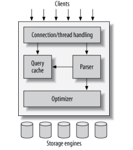

# High Performance MySQL
# 1 MySQL 架构与历史
本章主要介绍服务器架构、各种存储引擎之间的区别，以及这些区别的重要性。另外回顾mysql的历史以及基准测试。

## 1.1 MySQL的逻辑架构

最上层的服务并不是Mysql所独有的，大多数基于网络的客户端/服务器的工具或者服务都有类似的架构。比如连接处理，授权认证，安全等等。  
第二层：核心服务层，主要包括查询解析，分析，优化，缓存以及所有内置函数（例如日期，时间，数学和加密函数），所有跨存储引擎的功能都在这一层实现：存储过程，触发器，视图。  
第三层：包含存储引擎。存储引擎负责Mysql中数据的存储和提取。并且不同的存储引擎之间对上层是完全透明的。不同的引擎之间也不回相互通信。也不回解析SQL（InnoDB例外，它会解析外键定义）  
### 1.1.1 连接的管理与安全
Mysql为每一个客户端开启了一个线程（5.5之前，之后采用线程池--类似于reacter模式进行处理）。
安全上客户端或者应用连接服务端需要认证。认证是基于用户名，原始主机以及密码的信息。当然也可以使用基于ssl的x509认证。一旦客户端连接上，服务端就会通过查询客户端的权限进行表级别的授权。  
### 1.1.2 查询优化与执行
查询时会先构建解析树，然后进行优化重写查询和表的读取顺序以及选择合适的索引。  
优化器不关心第三层的存储引擎，但是存储引擎对于查询优化是有影响的。  
并且对于select语句，在查询之前服务器会先检查查询缓存，如果能够找到对应的查询，服务器就不必再查询解析。  
## 1.2 并发控制
MySQL利用锁的机制进行并发的控制，并发控制主要是服务器层和存储层进行并发控制。
### 1.2.1 读写锁
mysql通过读写锁的机制防止对同一数据产生冲突。
### 1.2.2 锁粒度
一般的常见商业数据库通过在表上施加行级锁，并以各种复杂的方式实现。而mysql提供了多种选择。每种存储引擎都有自己的锁策略和锁粒度。在存储引擎的设计中。锁管理是个非常重要的决定。主要的锁策略主要有两种  
1. 表锁
表锁是最基本的锁策略，并且是开销最小的策略。并且，写锁比读锁具有更好的优先级。
2. 行级锁
行级锁可以最大程度地支持并发处理，同时也带来了锁的开销，InnoDB和XtraDB以及其他的一些存储引擎实现了行级锁。
## 1.3 事务
一个运行良好的事务处理系统必须经过严格的ACID测试。
原子性，一致性，隔离性，持久性。
### 1.3.1 隔离级别
四种隔离级别分别为，
1. 未提交读（脏读）
2. 提交度（不可重复读）
3. 可重复读（幻读）
4. 串行化

### 1.3.2 死锁
死锁是指两个或者多个事务在同一资源上相互占用，并请求锁定对方占用的资源，从而导致恶性循环的现象。
InnoDB处理死锁的方法是将持有最少行锁的事务进行回滚释放锁。
### 1.3.3 事务日志
事务日志其实就是对数据的修改只修改内存副本，然后将修改持久化到磁盘。事务日志采用的是追加的方式，因此写日志的操作是磁盘上的一小块区域内的顺序IO.事务日志持久化后，内存中被修改的数据可以慢慢刷回到磁盘。（预写式日志 write ahead logging）.
### 1.3.4 MySQL中的事务
MySQL中的事务存储引擎主要有InnoDB和NDB Cluster，另外还有一些第三方存储引擎也支持事务，比较知名的有XtraDB和PBXT。  
1. 自动提交（默认）  
需要注意的是非事务型引擎没有提交和回滚概念，该字段没有任何影响。另外就是一些命令，如锁表的行为（ALTER TABLE）执行前都会自动提交事务。MYSQL可以通过设置事务的隔离级别（在下一次事务开始的时候生效）    
2. 事务中混合使用存储引擎  
需要了解在事务中回滚的话，如果数据使用了非事务型的表，那么在非事务的表示不能撤销的。  
3. 隐式和显示锁定
InnoDB采用的是两阶段锁定协议。在事务执行过程中，随时都可以执行锁定，锁只有在执行提交或者回滚时才会释放。并且所有的锁是在同一时刻被释放。InnoDB会根据隔离级别在需要的时候加锁。  
> 注意，一般除了事务中禁用了AUTOCOMMIT，可以使用LOCK TABLES之外，其他任何时候都不要显式地执行LOCK TABLES ,不管使用的是什么存储引擎。
## 1.4 多版本并发控制
大多数的Mysql的事务并不是简单的使用行锁机制。采用更为广泛的是多版本并发控制（MVCC），并且现在主流的如Oracle ,PostgreSQL也使用了这种高效的空间换时间的非锁来实现事务。  
MVCC的工作原理是保持数据在某个时间点的快照。这意味着事务可以看到一致的数据视图，无论它们运行多长时间。这也意味着不同的事务可以同时在相同的表中看到不同的数据。 
每个存储引擎以不同的方式实现MVCC。其中一些变体包括乐观并发控制和悲观并发控制。我们将通过解释InnoDB行为的简化版本来说明MVCC的一种工作方式。  
InnoDB通过在记录中添加两个字段来实现，分别是创建和删除版本（时间） 。每一个事务开启的时候都有一个创建版本（递增-对于同一行数据）。  
需要注意的是MVCC只在REPEATABLE READ 和READ COMMITTED两个级别下工作。
## 1.5 存储引擎
不同的存储引擎保存数据和索引的方式是不同的。但是在定义则是在mysql服务层同意处理的。查询每个数据库对应的表信息如下
```
USE quickfix;
SHOW TABLE STATUS LIKE 'messages'
```

### 1.5.1 InnoDB引擎
目前使用最多的支持事务的存储引擎，特别是5.1版本之后。    
特点  
1. 采用MVCC支持高并发，实现4个标准的隔离界别。并且通过间隙锁防止幻读。  
2. 基于聚簇建立索引。平台独立。  
3. 内部优化。内部实现可预测性读，自动在内存中创建hash索引(自适应哈希索引)，插入缓冲区    
4. 支持热备份。其他引擎不支持热备份。  
### 1.5.2 MyISAM引擎
MYSQL 5.1之前的more存储引擎，提供了大量的特性，如全文索引，压缩，空间函数等。但是该引擎不支持事务和行级锁，崩溃后无法安全恢复。  
1. 存储  
数据文件索引文件（MYD,MYI）分离。存储数据受限于磁盘空间或者os单个文件的最大尺寸。  
2. 特性
* 加锁与并发（对表加锁）
* 修复（可能丢失数据）
* 索引特性（即使是BLOB和等长字段，也可以基于前500个字符创建索引，支持全文索引）
* 延迟更新索引（主要提升写入性能）
3. 压缩表（导入数据后不修改时可以采用）
### 1.5.3 其他引擎
1. Archive引擎（只支持INSERT ,SELECT）
2. csv引擎（不支持索引-但是作为数据交换机制非常有用）
3. Memory引擎（比MyISQM快一个数量级，重启后数据丢失，但是结构还在。支持Hash索引，表级锁，并发写入性能较低）  
4. NDB集群引擎
### 1.5.4 第三方引擎
1. OLTP类引擎  
主要为开源或者github上的。如XtraDB/OLTP,TokuDB,RethinkDB,MySQL AB等。  
2. 面向列的存储引擎  
如Infobright,InfiniDB.
3. 社区存储引擎(不建议生产使用)  
Aria(MYSQL 设计者用来代替MyISAM的一款引擎)  
Groonga(号称准确而高效的全文索引)  
0QGraph支持图操作  
### 1.5.5 引擎的选择
大部分选择InnoDB都是正确的选择，除非特性不具备。例如全文索引的话，建议优先考虑InnoDB加上Sphinx的组合。而不是使用支持全文索引的MyISAM。  
考虑因素：  
1. 事务
支持的话（InnoDB,XtraDB），如果主要是SELECT 和INSERT那么MyISAM推荐（特别是日志型应用）  
2. 备份
如果支持在线热备（InnoDB）
3. 崩溃恢复。（InnoDB）
4. 特有特性
比如只有MyISAM支持地理空间搜索。
### 1.5.6 表的转换
常用的三种方法
1. ALTER TABLE   
例如
```
ALTER TABLE orders ENGINE = MYISAM;
```
需要注意该方式需要执行很长时间，因为会按行复制原表到新表中。同时会添加读锁。  
2. 导出导入  
使用mysqldump 工具导出数据。然后修改文件中的CREATETABLE语句的存储引擎选择。注意同事修改表名（并删除前面的DROP TABLE语句）。  
3. 创建与查询  
方式一
``` 
CREATE TABLE user_table LIKE USER;
ALTER user_table ENGINE=MYISAM ;
INSERT INTO user_table SELECT * FROM USER;
``` 
方式二
``` 
CREATE TABLE user_table LIKE USER;
ALTER user_table ENGINE=MYISAM ;
START TRANSACTION
INSERT INTO user_table SELECT * FROM USER WHERE id BETWEEN X AND Y；
COMMIT;
``` 
# 2 MySQL 基准测试
## 2.1 为什么需要基准测试
1. 验证基于系统的假设是否符合实际情况。  
2. 重现系统中的某些异常行为。   
3. 测试运行情况  
4. 模拟负载  
5. 规划未来业务增长。评估未来项目负载下需要什么样的硬件。  
6. 测试使用可变环境的能力。比如发现系统在随意的并发峰值下的性能表现  
7. 测试不同的硬件软件操作系统配置。  
8. 证明信采购设备是否配置正确。  
## 2.2 基准测试的策略
主要有两种一种是整个系统整体测试，另外是单独测试MySQL。这两种策略也被称为集成式以及单组件式基准测试。  
集成测试的原因  
1. 用户关注整体性能
2. mysql并非总是性能瓶颈
3. 只有整体测试才能发现各部分之间缓存带来的影响。  
4. 整体继承测试更能揭示应用的真是表现。
单独测试
1. 需要不同的schema或查询的性能。
2. 针对应用某个问题测试
### 2.2.1 测试何种数据

## 2.3 基准测试策略
### 2.3.1 基准设计和计划
### 2.3.2 基准应该持续多久
### 2.3.3 系统状态和性能获取
### 2.3.4 获取积累结果
### 2.3.5 运行基准和分析结果
### 2.3.6 绘图的重要性
## 2.4 基准工具
### 2.4.1 完整的工具
### 2.4.2 单组件工具
## 2.5 基准工具
### 2.5.1 http_load
### 2.5.2 Mysql 基准套件
### 2.5.3 sysbench
### 2.5.4 dbt2 TPC-C 
### 2.5.5 Percona TPCC-MySQL工具
## 2.6 总结
# 3 分析服务器性能
## 3.1 性能优化简介
### 3.1.1 通过分析进行优化
### 3.1.2 配置文件解析
## 3.2 分析你的应用
### 3.2.1 php安装
## 3.3 分析MySQL查询
### 3.3.1 服务端负载分析
### 3.3.2 单个查询分析
### 3.3.3  使用配置文件进行优化
## 3.4 问题诊断
### 3.4.1 单查询与服务器范围的问题
### 3.4.2 收集诊断数据
### 3.4.3  诊断学中的一个案例研究
## 3.5 其他的分析工具
### 3.5.1 使用USER_STATISTICS表
### 3.5.2 监视调试
## 3.6 总结

# 4 Schema和数据类型优化

## 4.1 选择最佳数据类型
### 4.1.1 整数
### 4.1.2 实数
### 4.1.3 字符串
### 4.1.4 日期和时间
### 4.1.5 基于Bit的数据
### 4.1.6 标识符的选择
### 4.1.7 特殊的数据类型
## 4.2 MySQL中的模式设计陷阱
## 4.3 规范化和非规范化
### 4.3.1 规范化利弊
### 4.3.2 非规范化利弊
### 4.3.3 规范化和非规范化的利弊
## 4.4 缓存与汇总表
### 4.4.1 实体化视图
### 4.4.2 计数器表
## 4.5 加速修改表
### 4.5.1 仅修改.frm文件
### 4.5.2 快速建立MyISAM索引
## 4.6 总结

# 5 高性能索引
# 6 查询性能优化
# 7 高级MySQL功能
# 8 优化服务器设置
# 9 操作系统和硬件优化
# 10 主从复制
# 11 MySQL扩展
# 12 高可用
# 13 存储云中的MySQL
# 14 应用程序级优化
# 15 备份与恢复
# 16 MySQL用户工具
