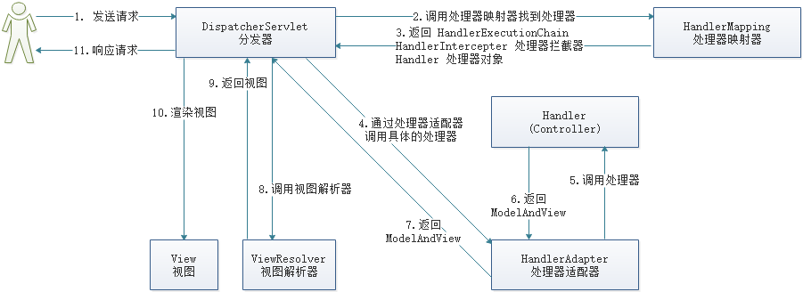
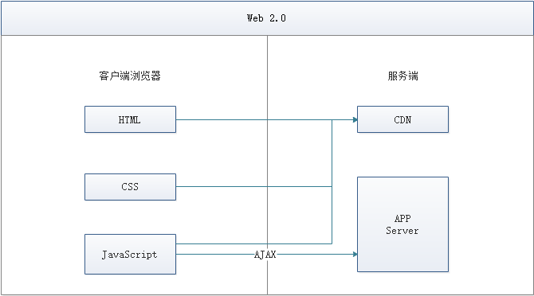
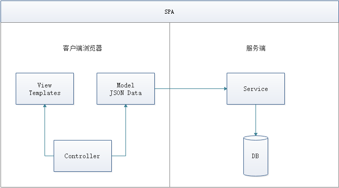
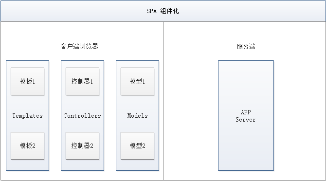
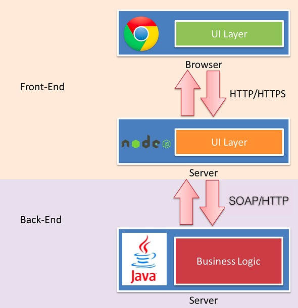

# 1. 前端三要素 
* HTML (结构):超文本标记语言（Hyper Text Markup Language），决定网页的结构和内容
* css(表现): 层叠样式表,设定网页的表现形式  
* JavaScript(行为):是一种弱类型的脚本语言,其源代码不需要编译,由浏览器解释运行,用于控制网页的行为.  
## 1.1. 表现层(CSS)  
CSS 层叠样式表是一门标记语言，并不是编程语言，因此不可以自定义变量，不可以引用等，换句话说就是不具备任何语法支持，它主要缺陷如下：  
* 语法不够强大，比如无法嵌套书写，导致模块化开发中需要书写很多重复的选择器；
* 没有变量和合理的样式复用机制，使得逻辑上相关的属性值必须以字面量的形式重复输出，导致难以维护；

这就导致了我们在工作中无端增加了许多工作量。为了解决这个问题，前端开发人员会使用一种称之为 【CSS 预处理器】 的工具，提供 CSS 缺失的样式层复用机制、减少冗余代码，提高样式代码的可维护性。大大提高了前端在样式上的开发效率。  
### 1.1.1. 什么是 CSS 预处理器  
CSS 预处理器定义了一种新的语言，其基本思想是，用一种专门的编程语言，为 CSS 增加了一些编程的特性，将 CSS 作为目标生成文件，然后开发者就只要使用这种语言进行 CSS 的编码工作。转化成通俗易懂的话来说就是“用一种专门的编程语言，进行 Web 页面样式设计，再通过编译器转化为正常的 CSS 文件，以供项目使用”。  
**常用的 CSS 预处理器有哪些**  
* SASS:基于 Ruby，通过服务端处理，功能强大。解析效率高。需要学习 Ruby 语言，上手难度高于 LESS。
* LESS：基于 NodeJS，通过客户端处理，使用简单。功能比 SASS 简单，解析效率也低于 SASS，但在实际开发中足够了，所以我们后台人员如果需要的话，建议使用 LESS。  

## 1.2. 行为层  
JavaScript 一门弱类型脚本语言，其源代码在发往客户端运行之前不需经过编译，而是将文本格式的字符代码发送给浏览器由浏览器解释运行。  
### 1.2.1. Native原生JS开发  
原生 JS 开发，也就是让我们按照 【ECMAScript】 标准的开发方式，简称是 ES，特点是所有浏览器都支持。截止到（2018 年 12 月 04 日），ES 标准已发布如下版本：  
* ES3
* ES4(内部,未正式发布)
* ES5(全浏览器支持)
* ES6(常用,当前主流版本)
* ES7
* ES8
* ES9
### 1.2.2. TypeScript 微软的标准
TypeScript 是一种由微软开发的自由和开源的编程语言。它是 JavaScript 的一个超集，而且本质上向这个语言添加了可选的静态类型和基于类的面向对象编程。由安德斯·海尔斯伯格（C#、Delphi、TypeScript 之父；.NET 创立者）主导。  
该语言的特点就是除了具备 ES 的特性之外还纳入了许多不在标准范围内的新特性，所以会导致很多浏览器不能直接支持 TypeScript 语法，需要编译后（编译成 JS）才能被浏览器正确执行。  
### 1.2.3. JavaScript 框架
* jQuery：大家熟知的 JavaScript 框架，优点是简化了 DOM 操作，缺点是 DOM 操作太频繁，影响前端性能；在前端眼里使用它仅仅是为了兼容 IE6、7、8；
* Angular：Google 收购的前端框架，由一群 Java 程序员开发，其特点是将后台的 MVC 模式搬到了前端并增加了模块化开发的理念，与微软合作，采用 TypeScript 语法开发；对后台程序员友好，对前端程序员不太友好；最大的缺点是版本迭代不合理（如：1代 -> 2代，除了名字，基本就是两个东西；截止发表博客时已推出了 Angular6）
* React：Facebook 出品，一款高性能的 JS 前端框架；特点是提出了新概念 【虚拟 DOM】 用于减少真实 DOM 操作，在内存中模拟 DOM 操作，有效的提升了前端渲染效率；缺点是使用复杂，因为需要额外学习一门 【JSX】 语言；
* Vue：一款渐进式 JavaScript 框架，所谓渐进式就是逐步实现新特性的意思，如实现模块化开发、路由、状态管理等新特性。其特点是综合了 Angular（模块化） 和 React（虚拟 DOM） 的优点；
* Axios：前端通信框架；因为 Vue 的边界很明确，就是为了处理 DOM，所以并不具备通信能力，此时就需要额外使用一个通信框架与服务器交互；当然也可以直接选择使用 jQuery 提供的 AJAX 通信功能；
### 1.2.4. UI框架  
* Ant-Design:阿里巴巴出品,基于React的UI框架  
* ElementUI:饿了么出品,基于Vue的UI框架  
* Bootstrap: Twitter推出的一个用于前端开发的开源工具包  
* AmazeUI:又叫“妹子 UI”，一款 HTML5 跨屏前端框架

### 1.2.5. JavaScript构建工具  
* Babel：JS 编译工具，主要用于浏览器不支持的 ES 新特性，比如用于编译 TypeScript
* WebPack：模块打包器，主要作用是打包、压缩、合并及按序加载

## 1.3. 三端统一  
### 1.3.1. 混合开发（Hybrid App）
主要目的是实现一套代码三端统一（PC、Android、iOS）并能够调用到设备底层硬件（如：传感器、GPS、摄像头等），打包方式主要有以下两种：  
* 云打包：HBuild -> HBuildX，DCloud 出品；API Cloud
* 本地打包： Cordova（前身是 PhoneGap）

### 1.3.2. 微信小程序
详见微信官网，这里就是介绍一个方便微信小程序 UI 开发的框架：WeUI
1.  mpvue  
mpvue 是美团开发的一个使用 Vue.js 开发小程序的前端框架，目前支持 微信小程序、百度智能小程序，头条小程序 和 支付宝小程序。 框架基于 Vue.js，修改了的运行时框架 runtime 和代码编译器 compiler 实现，使其可运行在小程序环境中，从而为小程序开发引入了 Vue.js 开发体验。  
[官网](http://mpvue.com/)  
[github](https://github.com/Meituan-Dianping/mpvue)    
>>备注：完备的 Vue 开发体验，并且支持多平台的小程序开发，推荐使用
2.  WeUI  
WeUI 是一套同微信原生视觉体验一致的基础样式库，由微信官方设计团队为微信内网页和微信小程序量身设计，令用户的使用感知更加统一。包含 button、cell、dialog、toast、article、icon 等各式元素。  
[官网](https://weui.io/)
[github](https://github.com/weui/weui.git) 
### 1.3.3. Flutter 
Flutter 是谷歌的移动端 UI 框架，可在极短的时间内构建 Android 和 iOS 上高质量的原生级应用。Flutter 可与现有代码一起工作, 它被世界各地的开发者和组织使用, 并且 Flutter 是免费和开源的。  
[官网](http://doc.flutter-dev.cn/)  
[github](https://github.com/flutter/flutter)  
>>备注：Google 出品，主要特点是快速构建原生 APP 应用程序，如做混合应用该框架为必选框架
## 1.4. 后端技术
前端人员为了方便开发也需要掌握一定的后端技术，但我们 Java 后台人员知道后台知识体系极其庞大复杂，所以为了方便前端人员开发后台应用，就出现了 NodeJS 这样的技术。

NodeJS 的作者已经声称放弃 NodeJS（说是架构做的不好再加上笨重的 node_modules，可能让作者不爽了吧），开始开发全新架构的 Deno

既然是后台技术，那肯定也需要框架和项目管理工具，NodeJS 框架及项目管理工具如下：
*  Express：NodeJS 框架
*  Koa：Express 简化版
*  NPM：项目综合管理工具，类似于 Maven
*  YARN：NPM 的替代方案，类似于 Maven 和 Gradle 的关系
## 1.5. 当前主流前端框架
### 1.5.1. Vue.js
1. iView  
iview 是一个强大的基于 Vue 的 UI 库，有很多实用的基础组件比 elementui 的组件更丰富，主要服务于 PC 界面的中后台产品。使用单文件的 Vue 组件化开发模式 基于 npm + webpack + babel 开发，支持 ES2015 高质量、功能丰富 友好的 API ，自由灵活地使用空间。    
[官网](https://www.iviewui.com/)  
[github](https://github.com/TalkingData/iview-weapp)  
[iview-admin](https://github.com/iview/iview-admin)  
>>备注：属于前端主流框架，选型时可考虑使用，主要特点是移动端支持较多  
2. ElementUI  
Element 是饿了么前端开源维护的 Vue UI 组件库，组件齐全，基本涵盖后台所需的所有组件，文档讲解详细，例子也很丰富。主要用于开发 PC 端的页面，是一个质量比较高的 Vue UI 组件库。    
[官网](http://element-cn.eleme.io/#/zh-CN)  
[github](https://github.com/ElementUI/element-starter)
[vue-element-admin](https://github.com/PanJiaChen/vue-element-admin)
>> 备注：属于前端主流框架，选型时可考虑使用，主要特点是桌面端支持较多
3. ICE  
飞冰是阿里巴巴团队基于 React/Angular/Vue 的中后台应用解决方案，在阿里巴巴内部，已经有 270 多个来自几乎所有 BU 的项目在使用。飞冰包含了一条从设计端到开发端的完整链路，帮助用户快速搭建属于自己的中后台应用。  
[官网](https://alibaba.github.io/ice)
[github](https://github.com/alibaba/ice)
4. VantUI
Vant UI 是有赞前端团队基于有赞统一的规范实现的 Vue 组件库，提供了一整套 UI 基础组件和业务组件。通过 Vant，可以快速搭建出风格统一的页面，提升开发效率。  
[官网地址](https://youzan.github.io/vant/#/zh-CN/intro)
[github](https://github.com/youzan/vant)

# 2. 前后端演变  
## 2.1. 三层架构+MVC

### 2.1.1. 什么是系统架构
所谓系统架构是指，整合应用系统程序大的结构。经常提到的系统结构有两种：三层架构与 MVC。这两种结构既有区别，又有联系。但这两种结构的使用，均是为了降低系统模块间的耦合度。  
### 2.1.2. 什么是三层架构  
三层架构是指：视图层 View、服务层 Service，与持久层 DAO。它们分别完成不同的功能。  
View 层：用于接收用户提交请求的代码  
Service 层：系统的业务逻辑主要在这里完成  
DAO 层：直接操作数据库的代码  
>>为了更好的降低各层间的耦合度，在三层架构程序设计中，采用面向抽象编程。即上层对下层的调用，是通过接口实现的。而下层对上层的真正服务提供者，是下层接口的实现类。服务标准（接口）是相同的，服务提供者（实现类）可以更换。这就实现了层间解耦合。    
  
### 2.1.3. 什么是MVC模式  
MVC，即 Model 模型、View 视图，及 Controller 控制器。  
* View：视图，为用户提供使用界面，与用户直接进行交互。
* Model：模型，承载数据，并对用户提交请求进行计算的模块。其分为两类，一类称为数据承载 Bean，一类称为业务处理 Bean。所谓数据承载 Bean 是指实体类，专门用户承载业务数据的，如 Student、User 等。而业务处理 Bean 则是指 Service 或 Dao 对象， 专门用于处理用户提交请求的。
* Controller：控制器，用于将用户请求转发给相应的 Model 进行处理，并根据 Model 的计算结果向用户提供相应响应。
**MVC 架构程序的工作流程**  
* 用户通过 View 页面向服务端提出请求，可以是表单请求、超链接请求、AJAX 请求等
* 服务端 Controller 控制器接收到请求后对请求进行解析，找到相应的 Model 对用户请求进行处理
* Model 处理后，将处理结果再交给 Controller
* Controller 在接到处理结果后，根据处理结果找到要作为向客户端发回的响应 View 页面。页面经渲染（数据填充）后，再发送给客户端。

  
**三层架构与MVC示意图**  
  
## 2.2. 为什么需要分离  
为了降低开发的复杂度，以后端为出发点，比如：Struts、SpringMVC 等框架的使用，就是后端的 MVC 时代;
以SpringMVC流程为例  
  
**优点**  
MVC 是一个非常好的协作模式，能够有效降低代码的耦合度，从架构上能够让开发者明白代码应该写在哪里。为了让 View 更纯粹，还可以使用 Thymeleaf、Freemarker 等模板引擎，使模板里无法写入 Java 代码，让前后端分工更加清晰。
**缺点**    
* 前端开发重度依赖开发环境，开发效率低，
* 前后端职责纠缠不清：模板引擎功能强大，依旧可以通过拿到的上下文变量来实现各种业务逻辑。  
* 对前端发挥的局限性：性能优化如果只在前端做空间非常有限，于是我们经常需要后端合作，但由于后端框架限制，我们很难使用 【Comet】、【BigPipe】 等技术方案来优化性能。  

## 2.3. 什么是前后端分离 
### 2.3.1. 基于AJAX带来的SPA时代  
时间回到 2005 年 AJAX（Asynchronous JavaScript And XML，异步 JavaScript 和 XML，老技术新用法） 被正式提出并开始使用 CDN 作为静态资源存储，于是出现了 JavaScript 王者归来（在这之前 JS 都是用来在网页上贴狗皮膏药广告的）的 SPA（Single Page Application）单页面应用时代。  
  
**优点**  
这种模式下，前后端的分工非常清晰，前后端的关键协作点是 AJAX 接口。看起来是如此美妙，但回过头来看看的话，这与 JSP 时代区别不大。复杂度从服务端的 JSP 里移到了浏览器的 JavaScript，浏览器端变得很复杂。类似 Spring MVC，这个时代开始出现浏览器端的分层架构：  
  
**缺点**  
* 前后端接口的约定： 如果后端的接口一塌糊涂，如果后端的业务模型不够稳定，那么前端开发会很痛苦；不少团队也有类似尝试，通过接口规则、接口平台等方式来做。有了和后端一起沉淀的 接口规则 ，还可以用来模拟数据，使得前后端可以在约定接口后实现高效并行开发。  
* 前端开发的复杂度控制： SPA 应用大多以功能交互型为主，JavaScript 代码过十万行很正常。大量 JS 代码的组织，与 View 层的绑定等，都不是容易的事情。  

### 2.3.2. 前端为主的MV*时代  
此处的 MV* 模式如下：  
* MVC（同步通信为主）：Model、View、Controller
* MVP（异步通信为主）：Model、View、Presenter  
* MVVM（异步通信为主）：Model、View、ViewModel

为了降低前端开发复杂度，涌现了大量的前端框架，比如：AngularJS、React、Vue.js、EmberJS 等，这些框架总的原则是先按类型分层，比如 Templates、Controllers、Models，然后再在层内做切分，如下图：  
  
**优点**  
* 前后端职责很清晰： 前端工作在浏览器端，后端工作在服务端。清晰的分工，可以让开发并行，测试数据的模拟不难，前端可以本地开发。后端则可以专注于业务逻辑的处理，输出 RESTful等接口。
* 前端开发的复杂度可控： 前端代码很重，但合理的分层，让前端代码能各司其职。
* 部署相对独立： 可以快速改进产品体验

**缺点**  
*  代码不能复用。比如后端依旧需要对数据做各种校验，校验逻辑无法复用浏览器端的代码。如果可以复用，那么后端的数据校验可以相对简单化。  
*  全异步，对 SEO 不利。往往还需要服务端做同步渲染的降级方案。  
*  性能并非最佳，特别是移动互联网环境下。
*  SPA 不能满足所有需求，依旧存在大量多页面应用。URL Design 需要后端配合，前端无法完全掌控。  
### 2.3.3. NodeJS 带来的全栈时代  
前端为主的 MV* 模式解决了很多很多问题，但如上所述，依旧存在不少不足之处。随着 NodeJS 的兴起，JavaScript 开始有能力运行在服务端。这意味着可以有一种新的研发模式：  
  

# 3. MVVM
## 什么是MVVM
MVVM（Model-View-ViewModel）是一种软件架构设计模式，由微软 WPF（用于替代 WinForm，以前就是用这个技术开发桌面应用程序的）和 Silverlight（类似于 Java Applet，简单点说就是在浏览器上运行的 WPF） 的架构师 Ken Cooper 和 Ted Peters 开发，是一种简化用户界面的**事件驱动编程方式**。由 John Gossman（同样也是 WPF 和 Silverlight 的架构师）于 2005 年在他的博客上发表。  
MVVM 源自于经典的 MVC（Model-View-Controller）模式（期间还演化出了 MVP（Model-View-Presenter） 模式）。MVVM 的核心是 ViewModel 层，负责转换 Model 中的数据对象来让数据变得更容易管理和使用，其作用如下：  
* 该层向上与视图层进行双向数据绑定  
* 向下与 Model 层通过接口请求进行数据交互    

  
MVVM 已经相当成熟了，主要运用但不仅仅在网络应用程序开发中。当下流行的 MVVM 框架有 Vue.js，AngularJS 等。  
>>需要注意两个核心的问题1. 双向绑定,2 数据驱动接口(set),其原理是观察者模式
## 为什么要使用 MVVM  
MVVM 模式和 MVC 模式一样，主要目的是分离视图（View）和模型（Model），有几大好处  
* 低耦合： 视图（View）可以独立于 Model 变化和修改，一个 ViewModel 可以绑定到不同的 View 上，当 View 变化的时候 Model 可以不变，当 Model 变化的时候 View 也可以不变。
* 可复用： 你可以把一些视图逻辑放在一个 ViewModel 里面，让很多 View 重用这段视图逻辑。
* 独立开发： 开发人员可以专注于业务逻辑和数据的开发（ViewModel），设计人员可以专注于页面设计。
* 可测试： 界面素来是比较难于测试的，而现在测试可以针对 ViewModel 来写。

  
### View 
View 是视图层，也就是用户界面。前端主要由 HTML 和 CSS 来构建，为了更方便地展现 ViewModel 或者 Model 层的数据，已经产生了各种各样的前后端模板语言，比如 FreeMarker、Thymeleaf 等等，各大 MVVM 框架如 Vue.js，AngularJS，EJS 等也都有自己用来构建用户界面的内置模板语言。  
### Model  
Model 是指数据模型，泛指后端进行的各种业务逻辑处理和数据操控，主要围绕数据库系统展开。这里的难点主要在于需要和前端约定统一的 接口规则  
### ViewModel  
ViewModel 是由前端开发人员组织生成和维护的视图数据层。在这一层，前端开发者对从后端获取的 Model 数据进行转换处理，做二次封装，以生成符合 View 层使用预期的视图数据模型。  
>>需要注意的是 ViewModel 所封装出来的数据模型包括视图的状态和行为两部分，而 Model 层的数据模型是只包含状态的    

* 比如页面的这一块展示什么，那一块展示什么这些都属于视图状态（展示） 
* 页面加载进来时发生什么，点击这一块发生什么，这一块滚动时发生什么这些都属于视图行为（交互）  

视图状态和行为都封装在了 ViewModel 里。这样的封装使得 ViewModel 可以完整地去描述 View 层`。由于实现了双向绑定，ViewModel 的内容会实时展现在 View 层，这是激动人心的，因为前端开发者再也不必低效又麻烦地通过操纵 DOM 去更新视图。    
MVVM 框架已经把最脏最累的一块做好了，我们开发者只需要处理和维护 ViewModel，更新数据视图就会自动得到相应更新，真正实现 事件驱动编程。   
View 层展现的不是 Model 层的数据，而是 ViewModel 的数据，由 ViewModel 负责与 Model 层交互，这就完全解耦了 View 层和 Model 层，这个解耦是至关重要的，它是前后端分离方案实施的重要一环。  

