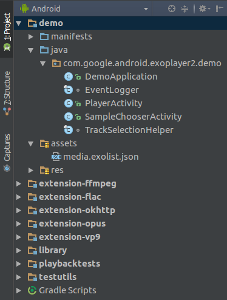
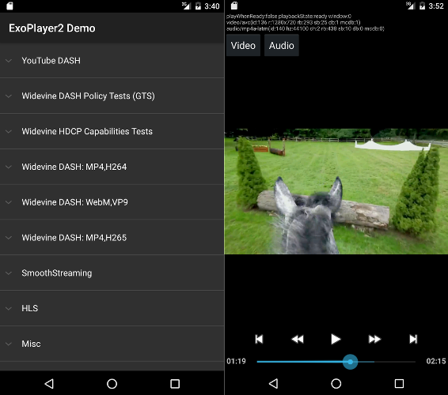
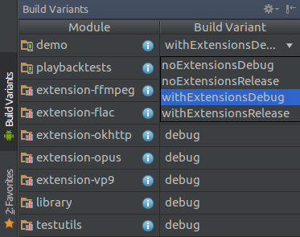

# 1. 介绍
## 1.1. 功能
ExoPlayer是适用于Android的应用程序级媒体播放器。它提供了Android的MediaPlayer API的替代方案，用于在本地和通过Internet播放音频和视频。ExoPlayer支持Android的MediaPlayer API当前不支持的功能，包括DASH和SmoothStreaming自适应回放。与MediaPlayer API不同，ExoPlayer易于定制和扩展，并且可以通过Play商店应用程序更新进行更新。  
## 1.2. 论坛
[开发者博客](https://medium.com/google-exoplayer)  
## 1.3. 文档
[开发指南](https://exoplayer.dev/guide.html)  
[常见问答](https://exoplayer.dev/faqs.html)  
[类依赖](https://exoplayer.dev/doc/reference/)  
[版本变化](https://github.com/google/ExoPlayer/blob/release-v2/RELEASENOTES.md)    
## 1.4. 源码
[github源码](https://github.com/google/ExoPlayer)  
# 2. 开发者指南
播放视频和音乐是Android设备上的热门活动。Android框架提供MediaPlayer了使用最少代码播放媒体的快速解决方案。它还提供低级媒体API，例如MediaCodec， AudioTrack和MediaDrm，可用于构建自定义媒体播放器解决方案。  
ExoPlayer是一个基于Android低级媒体API构建的开源应用级媒体播放器。本指南介绍了ExoPlayer库及其用法。它指的是ExoPlayer 主要演示应用程序中的代码，以提供具体示例。该指南涉及使用ExoPlayer的优缺点。它展示了如何使用ExoPlayer播放DASH，SmoothStreaming和HLS自适应流，以及MP4，M4A，FMP4，WebM，MKV，MP3，Ogg，WAV，MPEG-TS，MPEG-PS，FLV和ADTS等格式（ AAC）。它还讨论了ExoPlayer事件，消息，自定义和DRM支持。  
## 2.1. 利弊  
与Android内置的MediaPlayer相比，ExoPlayer具有许多优势：  
*  支持基于HTTP的动态自适应流传输(DASH)和SmoothStreaming,MediaPlayer均不支持这两种流.还支持许多其他格式.  
*  支持高级HLS功能，例如正确处理 #EXT-X-DISCONTINUITY标签。  
*  能够无缝合并，连接和循环媒体。  
*  能够随应用程序更新播放器。由于ExoPlayer是您在应用程序apk中包含的库，因此您可以控制使用的版本，并且可以轻松地将更新版本更新为常规应用程序更新的一部分。  
*  不同的设备特定问题和不同设备和Android版本的行为变化较小。  
*  支持Android 4.4（API级别19）及更高版本的Widevine通用加密。  
*  能够根据您的使用情况自定义和扩展播放器。ExoPlayer专门针对这一点而设计，允许使用自定义实现替换许多组件。  
*  能够使用官方扩展快速集成许多其他库。例如，IMA扩展程序可让您使用互动式媒体广告SDK轻松通过内容获利。  
缺点:耗电  
## 2.2. 库概览  
ExoPlayer库的核心是ExoPlayer界面。一个 ExoPlayer公开的传统高层次的媒体播放器功能，比如缓冲介质，播放，暂停和寻求的能力。实现的目的是对正在播放的媒体类型，存储方式和位置以及如何呈现的媒体类型做出很少的假设（因此几乎没有限制）。实现不是直接ExoPlayer 实现媒体的加载和呈现，而是将此工作委托给创建播放器或准备播放时注入的组件。所有ExoPlayer实现共有的组件是：  
* MediaSource定义要播放的媒体，加载媒体，并从中读取加载的媒体。A 在播放开始时MediaSource被注入 ExoPlayer.prepare  
* Renderers渲染媒体的各个组成部分。Renderer在创建播放器时注入s。  
* TrackSelector选择MediaSource由每个可用Renderers 提供的轨道。TrackSelector创建播放器时注入  
* LoadControl控制何时MediaSource缓冲更多媒体，以及缓冲多少媒体。LoadControl创建播放器时注入  
该库为常见用例提供了这些组件的默认实现，如下面更详细的描述。一个ExoPlayer可以利用这些组件，但也可以使用自定义的实现是否需要非标准行为建。例如LoadControl，可以注入自定义以更改播放器的缓冲策略，或者Renderer可以注入自定义以使用Android本身不支持的视频编解码器。  
整个库中都存在注入实现播放器功能的组件的概念。上面列出的组件的默认实现将工作委托给进一步注入的组件。这允许使用自定义实现单独替换许多子组件。例如，默认MediaSource实现需要DataSource通过其构造函数注入一个或多个工厂。通过提供自定义工厂，可以从非标准源或通过不同的网络堆栈加载数据。  
## 2.3. 开始  
对于简单的用例，入门ExoPlayer包括实现以下步骤：  
*  将ExoPlayer添加为项目的依赖项。
*  创建一个SimpleExoPlayer实例。 
*  将播放器连接到视图（用于视频输出和用户输入）。
*  准备玩家MediaSource玩。
*  完成后释放播放器

以下更详细地概述了这些步骤。对于一个完整的例子，是指 PlayerActivity在主演示应用程序。  
### 2.3.1. 添加依赖  
**添加存储库**  
入门的第一步是确保build.gradle项目根目录中的文件中包含Google和JCenter存储库。  
```
repositories {
    google()
    jcenter()
}
```
**添加ExoPlayer模块**  
接下来在build.gradleapp模块的文件中添加依赖项。以下内容将为完整的ExoPlayer库添加依赖项：  
```
implementation 'com.google.android.exoplayer:exoplayer:2.X.X'
```
2.X.X为你使用的版本
作为完整库的替代方法，您只能依赖于实际需要的库模块。例如，以下将添加对Core，DASH和UI库模块的依赖性，这可能是播放DASH内容的应用程序所需的：  
```
implementation 'com.google.android.exoplayer:exoplayer-core:2.X.X'
implementation 'com.google.android.exoplayer:exoplayer-dash:2.X.X'
implementation 'com.google.android.exoplayer:exoplayer-ui:2.X.X'
```
下面列出了可用的库模块。向完整的ExoPlayer库添加依赖项等同于单独添加所有库模块的依赖项。  
* exoplayer-core：核心功能（必需）。
* exoplayer-dash：支持DASH内容。
* exoplayer-hls：支持HLS内容。
* exoplayer-smoothstreaming：支持SmoothStreaming内容。
* exoplayer-ui：用于ExoPlayer的UI组件和资源。  

除了库模块，ExoPlayer还有多个扩展模块，它们依赖于外部库来提供附加功能。这些超出了本指南的范围。浏览扩展目录及其各自的README以获取详细信息。  
**打开Java 8支持**  
如果尚未启用，则还需要在所有build.gradle文件中打开Java 8支持， 具体取决于ExoPlayer，方法是在以下android部分添加以下 内容：  
```
compileOptions {
  targetCompatibility JavaVersion.VERSION_1_8
}
```
请注意，如果要在自己的代码中使用Java 8功能，则需要设置以下附加选项：  
```
// For Java compilers:
compileOptions {
  sourceCompatibility JavaVersion.VERSION_1_8
}
// For Kotlin compilers:
kotlinOptions {
  jvmTarget = JavaVersion.VERSION_1_8
}
```
### 2.3.2. 创建播放器
您可以ExoPlayer使用创建实例ExoPlayerFactory。工厂提供了一系列方法来创建ExoPlayer具有不同级别自定义的实例。对于绝大多数用例，ExoPlayerFactory.newSimpleInstance应该使用其中一种 方法。这些方法返回SimpleExoPlayer，扩展ExoPlayer为添加额外的高级播放器功能。下面的代码是创建一个的例子 SimpleExoPlayer。  
```
SimpleExoPlayer player = ExoPlayerFactory.newSimpleInstance(context);
```
必须从单个应用程序线程访问ExoPlayer实例。对于绝大多数情况，这应该是应用程序的主线程。使用ExoPlayer的UI组件或IMA扩展时，还需要使用应用程序的主线程。  
必须访问ExoPlayer实例的线程可以通过Looper在创建播放器时传递来明确指定。如果未Looper指定，则Looper使用创建播放器的线程，或者如果该线程没有Looper，Looper则使用应用程序的主线程。在所有情况下，Looper可以使用查询必须访问播放器的线程 Player.getApplicationLooper。  
### 2.3.3. 将播放器附加到视图
ExoPlayer库提供了一个PlayerView封装a PlayerControlView和a Surface视频的视图。A PlayerView 可以包含在应用程序的布局xml中。将播放器绑定到视图非常简单：  
```
// Bind the player to the view.
playerView.setPlayer(player);
```
如果您需要在播放器控制细粒度的控制和Surface 在其上渲染视频，可以设置玩家的目标SurfaceView， TextureView，SurfaceHolder或Surface直接使用SimpleExoPlayer的 setVideoSurfaceView，setVideoTextureView,setVideoSurfaceHolder和 setVideoSurface分别的方法。您可以将其PlayerControlView用作独立组件，或实现自己的播放控件，直接与播放器进行交互。setTextOutput和setId3Output可用于回放过程中接收字幕和ID3元数据输出。  
### 2.3.4. 准备播放器  
在ExoPlayer中，每个媒体都由代表MediaSource。要播放介质，必须首先创建一个对应的MediaSource，然后将此对象传递给ExoPlayer.prepare。ExoPlayer库提供 MediaSourceDASH（DashMediaSource），SmoothStreaming（SsMediaSource），HLS（HlsMediaSource）和常规媒体文件（ExtractorMediaSource）的实现。以下代码显示如何准备MediaSource适合播放MP4文件的播放器。  
```
// Produces DataSource instances through which media data is loaded.
DataSource.Factory dataSourceFactory = new DefaultDataSourceFactory(context,
    Util.getUserAgent(context, "yourApplicationName"));
// This is the MediaSource representing the media to be played.
MediaSource videoSource = new ExtractorMediaSource.Factory(dataSourceFactory)
    .createMediaSource(mp4VideoUri);
// Prepare the player with the source.
player.prepare(videoSource);
```
### 2.3.5. 控制播放器
一旦准备好了播放器，就可以通过调用播放器上的方法来控制播放。例如，setPlayWhenReady开始和暂停播放，各种seekTo方法在媒体内寻找，setRepeatMode控制媒体是否以及如何循环，setShuffleModeEnabled控制播放列表改组，以及 setPlaybackParameters调整播放速度和音高。  
如果玩家被绑定到PlayerView或者PlayerControlView用户与这些组件的交互将导致调用播放器上的相应方法。  
### 2.3.6. 监听事件
状态更改和回放错误等事件将报告给已注册的 Player.EventListener实例。注册监听器以接收此类事件很容易：  
```
// Add a listener to receive events from the player.
player.addListener(eventListener);  
```
如果您只对事件的子集感兴趣，那么扩展 Player.DefaultEventListener而非Player.EventListener 实现只允许您实现您感兴趣的方法。  
使用时SimpleExoPlayer，可以在播放器上设置其他侦听器。该 addVideoListener方法允许您接收与视频渲染相关的事件，这些事件可能对调整UI有用（例如，Surface正在渲染视频的宽高比 ）。该addAnalyticsListener方法允许您接收详细事件，这可能对分析有用。  
### 2.3.7. 释放
不再需要播放器时释放播放器非常重要，这样可以释放有限的资源，例如视频解码器，供其他应用程序使用。这可以通过调用来完成ExoPlayer.release。  
## 2.4. MediaSource
在ExoPlayer中，每个媒体都由代表MediaSource。ExoPlayer库提供MediaSourceDASH（DashMediaSource），SmoothStreaming（SsMediaSource），HLS（HlsMediaSource）和常规媒体文件（ExtractorMediaSource）的实现。可以PlayerActivity在主演示应用程序中找到如何实例化所有四个示例。  
除了上面描述的MediaSource的实现方式中，ExoPlayer库还提供ConcatenatingMediaSource，ClippingMediaSource， LoopingMediaSource和MergingMediaSource。这些MediaSource 实现通过组合实现更复杂的回放功能。一些常见用例如下所述。注意，尽管在视频回放的上下文中描述了以下示例，但是它们同样适用于仅音频回放，并且实际上适用于任何支持的媒体类型的回放。  
### 2.4.1. 播放列表
使用支持播放列表ConcatenatingMediaSource，可以顺序播放多个MediaSources。以下示例表示由两个视频组成的播放列表。  
```
MediaSource firstSource =
    new ExtractorMediaSource.Factory(...).createMediaSource(firstVideoUri);
MediaSource secondSource =
    new ExtractorMediaSource.Factory(...).createMediaSource(secondVideoUri);
// Plays the first video, then the second video.
ConcatenatingMediaSource concatenatedSource =
    new ConcatenatingMediaSource(firstSource, secondSource);
```
连接源之间的转换是无缝的。不要求它们具有相同的格式（例如，将包含480p H264的视频文件与包含720p VP9的视频文件连接起来很好）。它们甚至可能是不同类型的（例如，将视频与仅音频流连接起来很好）。允许MediaSource在连接中多次使用单个s。  
可以通过MediaSource在a中添加，删除和移动s 来动态修改播放列表 ConcatenatingMediaSource。这可以通过调用相应的ConcatenatingMediaSource 方法在回放之前和回放期间完成。播放器以正确的方式自动处理播放期间的修改。例如，如果当前正在播放MediaSource，则不会中断播放，并且将在完成时播放其新的后继播放。如果当前播放MediaSource被移除，则播放器将自动移动到播放第一个剩余的后继者，或者如果不存在这样的后继者则转换到结束状态。  
### 2.4.2. 剪辑视频
ClippingMediaSource可用于剪辑a，MediaSource以便只播放部分内容。以下示例将视频播放剪辑为以5秒开始并以10秒结束。  
```
MediaSource videoSource =
    new ExtractorMediaSource.Factory(...).createMediaSource(videoUri);
// Clip to start at 5 seconds and end at 10 seconds.
ClippingMediaSource clippingSource =
    new ClippingMediaSource(
        videoSource,
        /* startPositionUs= */ 5_000_000,
        /* endPositionUs= */ 10_000_000);
```
要仅剪辑源的开头，endPositionUs可以设置为 C.TIME_END_OF_SOURCE。要仅剪切到特定的持续时间，有一个构造函数接受一个durationUs参数。  
>>  剪切视频文件的开头时，尽可能将起始位置与关键帧对齐。如果开始位置未与关键帧对齐，则播放器将需要解码并丢弃从先前关键帧到开始位置的数据，然后才能开始播放。这将在播放开始时引入短暂的延迟，包括当播放器转换为播放ClippingMediaSource播放列表的一部分或由于循环播放时。  
### 2.4.3. 循环播放视频  
>>  要无限循环，通常最好使用ExoPlayer.setRepeatMode而不是LoopingMediaSource。  

视频可以使用a无缝循环固定次数 LoopingMediaSource。以下示例播放视频两次。  
```
MediaSource source =
    new ExtractorMediaSource.Factory(...).createMediaSource(videoUri);
// Plays the video twice.
LoopingMediaSource loopingSource = new LoopingMediaSource(source, 2);
```
### 2.4.4. 侧加载字幕文件
给定视频文件和单独的字幕文件，MergingMediaSource可用于将它们合并为单个源以进行回放。  
```
// Build the video MediaSource.
MediaSource videoSource =
    new ExtractorMediaSource.Factory(...).createMediaSource(videoUri);
// Build the subtitle MediaSource.
Format subtitleFormat = Format.createTextSampleFormat(
    id, // An identifier for the track. May be null.
    MimeTypes.APPLICATION_SUBRIP, // The mime type. Must be set correctly.
    selectionFlags, // Selection flags for the track.
    language); // The subtitle language. May be null.
MediaSource subtitleSource =
    new SingleSampleMediaSource.Factory(...)
        .createMediaSource(subtitleUri, subtitleFormat, C.TIME_UNSET);
// Plays the video with the sideloaded subtitle.
MergingMediaSource mergedSource =
    new MergingMediaSource(videoSource, subtitleSource);
```
### 2.4.5. 播放组合
可以进一步组合复合材料MediaSource以用于更多不寻常的用例。给定两个视频A和B，以下示例显示如何 LoopingMediaSource和ConcatenatingMediaSource可以一起使用来播放序列（A，A，B）。  
```
MediaSource firstSource =
    new ExtractorMediaSource.Factory(...).createMediaSource(firstVideoUri);
MediaSource secondSource =
    new ExtractorMediaSource.Factory(...).createMediaSource(secondVideoUri);
// Plays the first video twice.
LoopingMediaSource firstSourceTwice = new LoopingMediaSource(firstSource, 2);
// Plays the first video twice, then the second video.
ConcatenatingMediaSource concatenatedSource =
    new ConcatenatingMediaSource(firstSourceTwice, secondSource);
```
以下示例是等效的，表明可以有多种方法来实现相同的结果。  
```
MediaSource firstSource =
    new ExtractorMediaSource.Builder(firstVideoUri, ...).build();
MediaSource secondSource =
    new ExtractorMediaSource.Builder(secondVideoUri, ...).build();
// Plays the first video twice, then the second video.
ConcatenatingMediaSource concatenatedSource =
    new ConcatenatingMediaSource(firstSource, firstSource, secondSource);
```  
### 2.4.6. 音轨渲染
曲目选择确定播放器播放哪些可用媒体曲目Renderer。轨道选择是a的责任 TrackSelector，可以在ExoPlayer 构建时提供其实例。  
```
DefaultTrackSelector trackSelector = new DefaultTrackSelector();
SimpleExoPlayer player =
    ExoPlayerFactory.newSimpleInstance(context, trackSelector);
```
DefaultTrackSelectorTrackSelector适用于大多数用例的灵活性。使用a时DefaultTrackSelector，可以通过修改它来控制它选择的轨道Parameters。这可以在播放之前或播放期间完成。例如，以下代码告诉选择器将视频轨道选择限制为SD，并选择德语音轨（如果有）：  
```
trackSelector.setParameters(
    trackSelector
        .buildUponParameters()
        .setMaxVideoSizeSd()
        .setPreferredAudioLanguage("deu"));
```
这是基于约束的轨道选择的示例，其中在不知道实际可用的轨道的情况下指定约束。可以使用指定许多不同类型的约束Parameters。Parameters 也可用于从可用的轨道中选择特定轨道。有关 更多详细信息DefaultTrackSelector，请参阅Parameters和ParametersBuilder文档。  
## 2.5. 将消息发送到组件
可以向ExoPlayer组件发送消息。这些可以使用创建createMessage，然后使用发送PlayerMessage.send。默认情况下，消息尽快在回放线程上传递，但可以通过设置另一个回调线程（使用 PlayerMessage.setHandler）或指定传送回放位置（使用PlayerMessage.setPosition）来自定义。通过ExoPlayer 确保按顺序执行操作以及在播放器上执行任何其他操作来发送消息。  
大多数ExoPlayer的开箱即用渲染器都支持允许在播放期间更改其配置的消息。例如，音频渲染器接受消息来设置音量，视频渲染器接受消息来设置曲面。这些消息应在回放线程上传递，以确保线程安全。  
## 2.6. 定制  
ExoPlayer相对于Android的主要优势之一MediaPlayer是能够自定义和扩展播放器以更好地适应开发人员的使用案例。ExoPlayer库专门为此而设计，定义了许多接口和抽象基类，使应用程序开发人员可以轻松替换库提供的默认实现。以下是构建自定义组件的一些用例：  
* Renderer- 您可能希望实现自定义Renderer来处理库提供的默认实现不支持的媒体类型。  
* TrackSelector- 实现自定义TrackSelector允许应用程序开发人员更改MediaSource选择由每个可用Renderers 消耗的轨道的方式。  
* LoadControl- 实施自定义LoadControl允许应用开发者更改播放器的缓冲策略。  
* Extractor- 如果需要支持库当前不支持的容器格式，请考虑实现自定义Extractor类，然后可以将其与ExtractorMediaSource播放该类型的媒体一起使用。  
* MediaSource- MediaSource如果您希望获得以自定义方式提供给渲染器的媒体示例，或者您希望实现自定义MediaSource合成行为，则实现自定义类可能是合适的。  
* DataSource- ExoPlayer的上游包已经包含了许多DataSource针对不同用例的 实现。您可能希望实现自己的DataSource类以另一种方式加载数据，例如通过自定义协议，使用自定义HTTP堆栈或自定义持久缓存.  

构建自定义组件时，建议执行以下操作：  
*  如果自定义组件需要将事件报告回应用程序，我们建议您使用与现有ExoPlayer组件相同的模型执行此操作，其中事件侦听器与a一起传递Handler给组件的构造函数。  
*  我们建议自定义组件使用与现有ExoPlayer组件相同的模型，以允许应用程序在播放期间重新配置，如向组件发送消息中所述。为此，您应该ExoPlayerComponent在其handleMessage方法中实现并接收配置更改。您的应用应通过调用ExoPlayer sendMessages和blockingSendMessages 方法来传递配置更改。  
# 3. 演示
ExoPlayer的主要演示应用程序有两个主要用途：
1. 提供一个相对简单但功能齐全的ExoPlayer使用示例。演示应用程序可以作为开发自己的应用程序的便捷起点。
2. 为了方便尝试ExoPlayer。除了包含的示例之外，演示应用程序还可用于测试您自己内容的播放。

该页面描述了如何获取，编译和运行演示应用程序。它还介绍了如何使用它来播放自己的媒体。  
## 3.1. 获取代码 
[源码](https://github.com/google/ExoPlayer)  
主演示应用程序的源代码可以在demos/main我们的GitHub项目的文件夹中找到。如果您还没有这样做，请将项目克隆到本地目录：  
```
git clone https://github.com/google/ExoPlayer.git
``` 
接下来，在Android Studio中打开项目。您应该在Android项目视图中看到以下内容（演示应用程序的相关文件夹已展开）：  
  
## 3.2. 编译并运行
要编译和运行演示应用程序，请demo在Android Studio中选择并运行配置。该演示应用程序将在连接的Android设备上安装并运行。如果可能，我们建议使用物理设备。如果您希望使用模拟器，请阅读常见问题解答 - ExoPlayer是否支持模拟器？并确保您的虚拟设备使用API​​级别至少为23的系统映像。  

演示应用程序提供了一个样本列表（SampleChooserActivity）。选择样本将打开第二个活动（PlayerActivity）以进行回放。该演示具有播放控件和曲目选择功能。它还有一个 EventLogger类，可以向系统日志输出有用的调试信息。可以使用以下命令查看此日志记录（以及其他标记的错误级别日志记录）：  
```
adb logcat EventLogger:V *:E
```
## 3.3. 编解码扩展
ExoPlayer有许多扩展，允许使用捆绑软件解码器，包括VP9，Opus，FLAC和FFMPEG（仅限音频）。可以构建演示应用程序以包含和使用这些扩展，如下所示：  
1. 构建要包含的每个扩展。请注意，这是一个手动过程。有关说明，请参阅README.md每个扩展中的文件。  
2. 在Android Studio的Build Variants视图中，将演示模块的构建变量设置为withExtensionsDebug或withExtensionsRelease如图3所示  
3. 正常编译，安装和运行demo配置
  
默认情况下，仅当不存在合适的平台解码器时才使用扩展解码器。可以指定扩展解码器应该是首选，如以下部分所述。  
## 3.4. 播放自己的内容
有多种方法可以在演示应用中播放您自己的内容。  
* 编辑assets / media.exolist.json  

演示应用程序中列出的示例是从中加载的assets/media.exolist.json。通过编辑此JSON文件，可以在演示应用程序中添加和删除样本。模式如下，其中[O]表示可选属性。 
```
[
  {
    "name": "Name of heading",
    "samples": [
      {
        "name": "Name of sample",
        "uri": "The URI/URL of the sample",
        "extension": "[O] Sample type hint. Values: mpd, ism, m3u8",
        "drm_scheme": "[O] Drm scheme if protected. Values: widevine, playready, clearkey",
        "drm_license_url": "[O] URL of the license server if protected",
        "drm_key_request_properties": "[O] Key request headers if protected",
        "drm_multi_session": "[O] Enables key rotation if protected",
        "spherical_stereo_mode": "[O] Enables spherical view. Values: mono, top_bottom, left_right"
      },
      ...etc
    ]
  },
  ...etc
]
```
可以使用模式指定样本的播放列表：  
```
[
  {
    "name": "Name of heading",
    "samples": [
      {
        "name": "Name of playlist sample",
        "drm_scheme": "[O] Drm scheme if protected. Values: widevine, playready, clearkey",
        "drm_license_url": "[O] URL of the license server if protected",
        "drm_key_request_properties": "[O] Key request headers if protected",
        "drm_multi_session": "[O] Enables key rotation if protected"
        "playlist": [
          {
            "uri": "The URI/URL of the first sample in the playlist",
            "extension": "[O] Sample type hint. Values: mpd, ism, m3u8"
          },
          {
            "uri": "The URI/URL of the first sample in the playlist",
            "extension": "[O] Sample type hint. Values: mpd, ism, m3u8"
          },
          ...etc
        ]
      },
      ...etc
    ]
  },
  ...etc
]
```
如果需要，将键请求标头指定为包含每个标头的字符串属性的对象：  
```
"drm_key_request_properties": {
  "name1": "value1",
  "name2": "value2",
  ...etc
}
```
在示例选择器活动中，溢出菜单包含用于指定是否更喜欢扩展解码器以及应使用哪种ABR算法的选项。  

* 加载外部exolist.json文件

演示应用程序可以使用上面的模式加载外部JSON文件，并根据*.exolist.json约定命名。例如，如果您在https://yourdomain.com/samples.exolist.json此处托管此类文件，则可以使用以下命令在演示应用中打开它：  
```
adb shell am start -d https://yourdomain.com/samples.exolist.json
```
单击*.exolist.json安装了演示应用程序的设备上的链接（例如，在浏览器或电子邮件客户端中）也将在演示应用程序中打开它。因此托管*.exolist.jsonJSON文件提供了一种简单的方式来分发内容供其他人在演示应用程序中尝试。  
* 激发意图
意图可用于绕过样本列表并直接启动到播放。要播放单个样本，请将intent的操作设置
com.google.android.exoplayer.demo.action.VIEW为其要播放的样本的 数据URI。可以使用以下方式从终端触发这样的意图：  
```
adb shell am start -a com.google.android.exoplayer.demo.action.VIEW \
    -d https://yourdomain.com/sample.mp4
```
单个样本意图支持的可选附加功能包括：  
*  extension[String]示例类型提示。有效值：mpd，ism，m3u8
*  prefer_extension_decoders [Boolean]扩展解码器是否优先于平台解码器
*  abr_algorithm[String]用于自适应回放的ABR算法。有效值为default和random。
*  drm_scheme[String]受保护的DRM方案。有效值为widevine， playready和clearkey。DRM方案UUID也被接受。
*  drm_license_url [String]许可证服务器的URL如果受到保护
*  drm_key_request_properties [String array]密钥请求标头打包为name1，value1，name2，value2等，如果受保护
*  drm_multi_session：[Boolean]如果受保护，则启用键旋转
*  spherical_stereo_mode[String]启用球形视图。值：mono， top_bottom和left_right。  

当adb shell am start用于触发intent时，可以使用--es（例如--es extension mpd）设置可选的字符串extra 。可以使用--ez（例如--ez prefer_extension_decoders TRUE）设置可选的布尔额外值。可以使用--esa（例如 --esa drm_key_request_properties name1,value1）设置可选的字符串数组extra 。  
要播放样本的播放列表，请将intent的操作设置为 com.google.android.exoplayer.demo.action.VIEW_LIST并使用uri_list字符串数组而不是数据URI。例如：  
```
adb shell am start -a com.google.android.exoplayer.demo.action.VIEW_LIST \
    --esa uri_list https://a.com/sample1.mp4,https://b.com/sample2.mp4
```
播放列表意图支持的可选附加功能包括：  
* extension_list[String array]示例类型提示。条目可以为空或以下之一：mpd，ism，m3u8
* prefer_extension_decoders，abr_algorithm，drm_scheme，drm_license_url， drm_key_request_properties和drm_multi_session，所有如上所述  
# 4. 支持的格式

# 5. 支持的设备
# 6. 常见问题
# 7. OEM测试