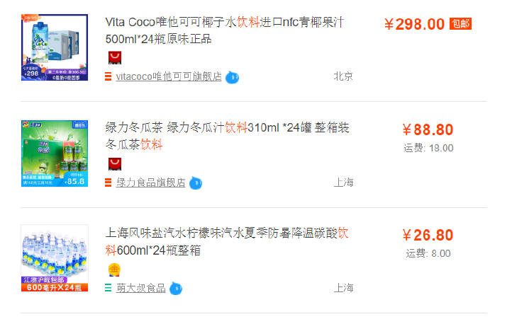

# 1. 数据库高并发处理方案之-shareding jdbc
# 2. 分库分表
分库分表是什么?  
小明是一家初创电商平台的开发人员，他负责卖家模块的功能开发，其中涉及了店铺、商品的相关业务，设计如下数据库：   
    
通过以下SQL能够获取到商品相关的店铺信息、地理区域信息：  
```
SELECT p.*,r.[地理区域名称],s.[店铺名称],s.[信誉]
FROM [商品信息] p
LEFT JOIN [地理区域] r ON p.[产地] = r.[地理区域编码]
LEFT JOIN [店铺信息] s ON p.id = s.[所属店铺]
WHERE p.id = ?
```
查找数据如下:  
  
随着公司业务快速发展，数据库中的数据量猛增，访问性能也变慢了，优化迫在眉睫。分析一下问题出现在哪儿呢？ 关系型数据库本身比较容易成为系统瓶颈，单机存储容量、连接数、处理能力都有限。当单表的数据量达到1000W或100G以后，由于查询维度较多，即使添加从库、优化索引，做很多操作时性能仍下降严重。   
方案一:  
通过提升服务器硬件能力来提高数据处理能力，比如增加存储容量 、CPU等，这种方案成本很高，并且如果瓶颈在MySQL本身那么提高硬件也是有很的。   
方案二:  
把数据分散在不同的数据库中，使得单一数据库的数据量变小来缓解单一数据库的性能问题，从而达到提升数据库性能的目的，如下图：将电商数据库拆分为若干独立的数据库，并且对于大表也拆分为若干小表，通过这种数据库拆分的方法来解决数据库的性能问题。  
  
分库分表就是为了解决由于数据量过大而导致数据库性能降低的问题，将原来独立的数据库拆分成若干数据库组成，将数据大表拆分成若干数据表组成，使得单一数据库、单一数据表的数据量变小，从而达到提升数据库性能的目的。  
## 2.1. 分库分表的方式
根据两个维度进行拆分  
||分库|分表|
|:---|:---|:---|
|水平|水平分库|水平分表|
|垂直|垂直分库|垂直分表|  
垂直分原则:冷热数据拆分.  
水平分原则:地域,时间,业务.  
### 2.1.1. 垂直分表
垂直分表定义:将一个表按照字段分成多表,每个表存储其中一部分字段.  
比如将冷热数据(商品表拆分)  
  

**优缺点**  
优点:  
1. 为了避免IO争抢并减少锁表的几率，查看详情的用户与商品信息浏览互不影响  
2. 充分发挥热门数据的操作效率，商品信息的操作的高效率不会被商品描述的低效率所拖累。
3. 数据传输流量减少.  
>>  一般来说，某业务实体中的各个数据项的访问频次是不一样的，部分数据项可能是占用存储空间比较大的BLOB或是TEXT。例如上例中的商品描述。所以，当表数据量很大时，可以将表按字段切开，将热门字段、冷门字段分开放置在不同库中，这些库可以放在不同的存储设备上，避免IO争抢。垂直切分带来的性能提升主要集中在热门数据的操作效率上，而且磁盘争用情况减少。  

拆分细则:  
1. 把不常用的字段单独放在一张表;    
2. 把text，blob等大字段拆分出来放在附表中;    
3. 经常组合查询的列放在一张表中;    
### 2.1.2. 垂直分库  
主要解决垂直分表在硬件资源上的缺陷. 
通过垂直分表性能得到了一定程度的提升，但是还没有达到要求，并且磁盘空间也快不够了，因为数据还是始终限制在一台服务器，库内垂直分表只解决了单一表数据量过大的问题，但没有将表分布到不同的服务器上，因此每个表还是竞争同一个物理机的CPU、内存、网络IO、磁盘。    
经过思考，他把原有的SELLER_DB(卖家库)，分为了PRODUCT_DB(商品库)和STORE_DB(店铺库)，并把这两个库分散到不同服务器，如下图：  
  
由于**商品信息**与**商品描述**业务耦合度较高，因此一起被存放在PRODUCT_DB(商品库)；而店铺信息相对独立，因此单独被存放在STORE_DB(店铺库)。     
# 3. 读写分离