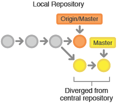
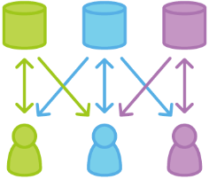

# gitlab搭建
镜像获取
```
# gitlab-ce为稳定版本，后面不填写版本则默认pull最新latest版本
$ docker pull gitlab/gitlab-ce
```
运行镜像
```
$ docker run -d  -p 443:443 -p 80:80 -p 222:22 --name gitlab --restart always -v /home/gitlab/config:/etc/gitlab -v /home/gitlab/logs:/var/log/gitlab -v /home/gitlab/data:/var/opt/gitlab gitlab/gitlab-ce
# -d：后台运行
# -p：将容器内部端口向外映射
# --name：命名容器名称
# -v：将容器内数据文件夹或者日志、配置等文件夹挂载到宿主机指定目录
```


# git工作流
工作流有各式各样的用法，但也正因此使得在实际工作中如何上手使用增加了难度。这篇指南通过总览公司团队中最常用的几种 Git 工作流让大家可以上手使用。  
在阅读的过程中请记住，本文中的几种工作流是作为方案指导而不是条例规定。在展示了各种工作流可能的用法后，你可以从不同的工作流中挑选或揉合出一个满足你自己需求的工作流。  
## 集中式工作流  
如果你的开发团队成员已经很熟悉 Subversion，集中式工作流让你无需去适应一个全新流程就可以体验 Git 带来的收益。这个工作流也可以作为向更 Git 风格工作流迁移的友好过渡。  
  
转到分布式版本控制系统看起来像个令人生畏的任务，但不改变已用的工作流你也可以用上 Git 带来的收益。团队可以用和 Subversion 完全不变的方式来开发项目。  
但使用 Git 加强开发的工作流，Git 比 SVN 有几个优势。首先，每个开发可以有属于自己的整个工程的本地拷贝。隔离的环境让各个开发者的工作和项目的其他部分（修改）独立开来 —— 即自由地提交到自己的本地仓库，先完全忽略上游的开发，直到方便的时候再把修改反馈上去。  
其次，Git 提供了强壮的分支和合并模型。不像 SVN，Git 的分支设计成可以做为一种用来在仓库之间集成代码和分享修改的『失败安全』的机制。  
### 工作方式  
像 Subversion 一样，集中式工作流以中央仓库作为项目所有修改的单点实体。相比 SVN 缺省的开发分支 trunk，Git 叫做 master，所有修改提交到这个分支上。该工作流只用到 master 这一个分支。  
开发者开始先克隆中央仓库。在自己的项目拷贝中，像 SVN 一样的编辑文件和提交修改；但修改是存在本地的，和中央仓库是完全隔离的。开发者可以把和上游的同步延后到一个方便时间点。  
要发布修改到正式项目中，开发者要把本地 master 分支的修改『推（push）』到中央仓库中。这相当于 svn commit 操作，但 push 操作会把所有还不在中央仓库的本地提交都推上去。  
  
### 解决冲突
中央仓库代表了正式项目，所以提交历史应该被尊重且是稳定不变的。如果开发者本地的提交历史和中央仓库有分歧，Git 会拒绝 push 提交否则会覆盖已经在中央库的正式提交。   
  
在开发者提交自己功能修改到中央库前，需要先 fetch 在中央库的新增提交，rebase 自己提交到中央库提交历史之上。这样做的意思是在说，『我要把自己的修改加到别人已经完成的修改上。』最终的结果是一个完美的线性历史，就像以前的SVN 的工作流中一样。  
如果本地修改和上游提交有冲突，Git 会暂停 rebase 过程，给你手动解决冲突的机会。Git 解决合并冲突，用和生成提交一样的 git status 和 git add 命令，很一致方便。还有一点，如果解决冲突时遇到麻烦，Git 可以很简单中止整个 rebase 操作，重来一次（或者让别人来帮助解决）。  
### 场景故事  
让我们一起逐步分解来看看一个常见的小团队如何用这个工作流来协作的。有两个开发者a和b，看他们是如何开发自己的功能并提交到中央仓库上的。
TODO:https://www.funtl.com/zh/git/%E9%9B%86%E4%B8%AD%E5%BC%8F%E5%B7%A5%E4%BD%9C%E6%B5%81.html#%E7%A4%BA%E4%BE%8B  
1. 创建项目
2. 所有人克隆中央仓库
3. 


## 功能分支工作流
功能分支工作流以集中式工作流为基础，不同的是为各个新功能分配一个专门的分支来开发。这样可以在把新功能集成到正式项目前，用 Pull Requests 的方式讨论变更。  
  
## GitFlow 工作流
GitFlow 工作流通过为功能开发、发布准备和维护分配独立的分支，让发布迭代过程更流畅。严格的分支模型也为大型项目提供了一些非常必要的结构。  
  
## Forking 工作流  
  
  
## Pull Requests
Pull requests 让开发者更方便地进行协作的功能，提供了友好的 Web 界面可以在提议的修改合并到正式项目之前对修改进行讨论。  
  
